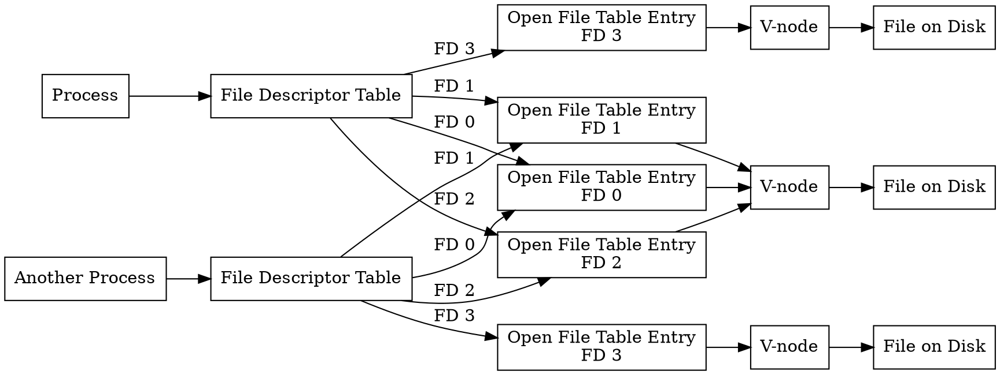

## Table of Contents
1. [Introduction](#introduction)
2. [The File Descriptor Table](#the-file-descriptor-table)
3. [The Open File Table](#the-open-file-table)
4. [The V-node Table](#the-v-node-table)
5. [File Operations and System Calls](#file-operations-and-system-calls)
   - [Opening a File](#opening-a-file)
   - [Reading from a File](#reading-from-a-file)
   - [File Descriptor Duplication](#file-descriptor-duplication)
6. [Pipes and Inter-Process Communication](#pipes-and-inter-process-communication)
7. [Putting It All Together: Implementing a Simple Shell](#putting-it-all-together-implementing-a-simple-shell)
8. [Conclusion](#conclusion)
9. [Flow Diagram](#flow-diagram)

## Introduction
In the world of operating systems, particularly Unix-like systems such as Linux, file management is a crucial aspect that underlies much of the functionality we take for granted. This blog post delves into the intricacies of how these systems keep track of files, manage file descriptors, and implement features like pipes for inter-process communication. We'll explore the underlying data structures, system calls, and provide C code examples to illustrate these concepts.

## The File Descriptor Table

At the heart of file management in Unix-like systems is the file descriptor table. This is a per-process data structure that serves as the user-facing interface for file operations. Each open file is represented by an integer, known as a file descriptor, which acts as an index into this table.

Let's consider a simple C program that opens a file:

```c
#include <fcntl.h>
#include <stdio.h>
#include <unistd.h>

int main() {
    int fd = open("example.txt", O_RDONLY);
    if (fd == -1) {
        perror("Error opening file");
        return 1;
    }
    printf("File descriptor: %d\n", fd);
    close(fd);
    return 0;
}
```

In this example, the `open` system call returns a file descriptor, which is typically 3 (as 0, 1, and 2 are reserved for standard input, output, and error respectively). This integer is used in subsequent operations like `read`, `write`, or `close`.

The file descriptor table has a maximum size, which can be queried using the `ulimit -n` command in most Unix-like systems. On many systems, this limit is set to 1024 by default, but it can be much higher on modern systems.

## The Open File Table

While the file descriptor table is per-process, the open file table is a system-wide data structure. Each entry in this table represents an open instance of a file and contains information such as:

- The current file offset (position)
- The access mode (read, write, etc.)
- A reference count

The reference count is particularly interesting as it allows multiple file descriptors to point to the same open file table entry. This becomes important in scenarios involving process forking or duplicating file descriptors.

Here's a simplified representation of how these structures might be implemented:

```c
struct file_descriptor {
    int flags;
    struct file *file_ptr;
};

struct file {
    off_t f_pos;
    unsigned int f_mode;
    int f_count;
    struct inode *f_inode;
};

#define MAX_OPEN_FILES 1024

struct file_descriptor fd_table[MAX_OPEN_FILES];
struct file open_file_table[MAX_OPEN_FILES];
```

## The V-node Table

The v-node (virtual node) table is another system-wide structure that represents the actual files on the disk. Each v-node contains information about:

- File type (regular file, directory, device, etc.)
- File size
- File permissions
- Physical location on disk

The v-node abstraction allows the operating system to support different file systems and even network file systems transparently.

## File Operations and System Calls

Let's explore some common file operations and how they interact with these data structures:

### Opening a File

When you call `open`, the following steps occur:

1. The system locates the file on disk and creates a v-node if one doesn't exist.
2. An entry is created in the open file table.
3. An entry is created in the process's file descriptor table, pointing to the open file table entry.

### Reading from a File

When you call `read`, the system:

1. Looks up the file descriptor in the process's file descriptor table.
2. Finds the corresponding open file table entry.
3. Uses the current file offset to determine where to read from.
4. Updates the file offset after reading.

Here's an example of reading from a file:

```c
#include <fcntl.h>
#include <unistd.h>
#include <stdio.h>

#define BUFFER_SIZE 1024

int main() {
    int fd = open("example.txt", O_RDONLY);
    if (fd == -1) {
        perror("Error opening file");
        return 1;
    }

    char buffer[BUFFER_SIZE];
    ssize_t bytes_read;

    while ((bytes_read = read(fd, buffer, BUFFER_SIZE)) > 0) {
        write(STDOUT_FILENO, buffer, bytes_read);
    }

    if (bytes_read == -1) {
        perror("Error reading file");
    }

    close(fd);
    return 0;
}
```

### File Descriptor Duplication

The `dup2` system call is used to duplicate file descriptors. This is crucial for implementing I/O redirection and pipes. Here's how it works:

1. It takes two file descriptors as arguments: the source and the target.
2. If the target file descriptor is already open, it is closed first.
3. The target file descriptor is made to point to the same open file table entry as the source.

Here's an example of using `dup2` to redirect standard output to a file:

```c
#include <fcntl.h>
#include <unistd.h>
#include <stdio.h>

int main() {
    int fd = open("output.txt", O_WRONLY | O_CREAT | O_TRUNC, 0644);
    if (fd == -1) {
        perror("Error opening file");
        return 1;
    }

    if (dup2(fd, STDOUT_FILENO) == -1) {
        perror("Error redirecting stdout");
        return 1;
    }

    printf("This will be written to output.txt\n");

    close(fd);
    return 0;
}
```

## Pipes and Inter-Process Communication

Pipes are a powerful feature of Unix-like systems that allow for inter-process communication. They are implemented using the file abstraction, which means they can be manipulated using the same system calls as regular files.

When you create a pipe using the `pipe` system call, the system:

1. Creates two file descriptors: one for reading and one for writing.
2. Sets up a kernel buffer to hold the data being passed through the pipe.

Here's an example of creating and using a pipe:

```c
#include <unistd.h>
#include <stdio.h>
#include <string.h>

#define BUFFER_SIZE 1024

int main() {
    int pipefd[2];
    char buffer[BUFFER_SIZE];

    if (pipe(pipefd) == -1) {
        perror("Error creating pipe");
        return 1;
    }

    pid_t pid = fork();

    if (pid == -1) {
        perror("Error forking process");
        return 1;
    } else if (pid == 0) {  // Child process
        close(pipefd[1]);  // Close unused write end

        ssize_t bytes_read = read(pipefd[0], buffer, BUFFER_SIZE);
        if (bytes_read > 0) {
            printf("Child received: %s", buffer);
        }

        close(pipefd[0]);
    } else {  // Parent process
        close(pipefd[0]);  // Close unused read end

        const char *message = "Hello from parent!\n";
        write(pipefd[1], message, strlen(message));

        close(pipefd[1]);
    }

    return 0;
}
```

This example demonstrates how a pipe can be used to send data from a parent process to a child process. The `fork` system call creates a new process, and both processes inherit the file descriptors for the pipe. The parent process writes to the pipe, and the child process reads from it.

## Putting It All Together: Implementing a Simple Shell

Now that we understand the underlying mechanisms, let's implement a simple shell that can execute commands and support basic piping. This example will tie together many of the concepts we've discussed:

```c
#include <stdio.h>
#include <stdlib.h>
#include <string.h>
#include <unistd.h>
#include <sys/wait.h>
#include <fcntl.h>
#include <errno.h>
#include <pwd.h>

#define MAX_CMD_LENGTH 1024
#define MAX_ARGS 64
#define MAX_PATH 1024

void print_prompt() {
    char hostname[1024];
    char cwd[MAX_PATH];
    struct passwd *pw = getpwuid(getuid());

    gethostname(hostname, sizeof(hostname));
    getcwd(cwd, sizeof(cwd));

    printf("\033[1;32m%s@%s\033[0m:\033[1;34m%s\033[0m$ ", pw->pw_name, hostname, cwd);
    fflush(stdout);
}

void execute_command(char *args[], int input_fd, int output_fd) {
    pid_t pid = fork();
    if (pid == -1) {
        perror("\033[1;31mError forking process\033[0m");
        exit(1);
    } else if (pid == 0) {
        if (input_fd != STDIN_FILENO) {
            dup2(input_fd, STDIN_FILENO);
            close(input_fd);
        }
        if (output_fd != STDOUT_FILENO) {
            dup2(output_fd, STDOUT_FILENO);
            close(output_fd);
        }

        printf("\033[1;33mExecuting command: %s\033[0m\n", args[0]);
        execvp(args[0], args);
        fprintf(stderr, "\033[1;31mError executing command '%s': %s\033[0m\n", args[0], strerror(errno));
        exit(1);
    }
}

int main() {
    char input[MAX_CMD_LENGTH];
    char *commands[MAX_ARGS];
    int num_commands;
    int i;

    printf("\033[1;36mWelcome to MyShell!\033[0m\n");
    printf("Type 'exit' to quit the shell.\n\n");

    while (1) {
        print_prompt();

        if (fgets(input, sizeof(input), stdin) == NULL) {
            printf("\n");
            break;
        }

        input[strcspn(input, "\n")] = 0;

        if (strcmp(input, "exit") == 0) {
            printf("\033[1;36mGoodbye!\033[0m\n");
            break;
        }

        num_commands = 0;
        commands[num_commands] = strtok(input, "|");
        while (commands[num_commands] != NULL) {
            num_commands++;
            commands[num_commands] = strtok(NULL, "|");
        }

        int pipes[2];
        int input_fd = STDIN_FILENO;

        for (i = 0; i < num_commands; i++) {
            char *args[MAX_ARGS];
            int arg_count = 0;
            char *token;

            // Split command into arguments
            token = strtok(commands[i], " ");
            while (token != NULL) {
                args[arg_count++] = token;
                token = strtok(NULL, " ");
            }
            args[arg_count] = NULL;

            if (i < num_commands - 1) {
                if (pipe(pipes) == -1) {
                    perror("\033[1;31mError creating pipe\033[0m");
                    exit(1);
                }
            }

            int output_fd = (i == num_commands - 1) ? STDOUT_FILENO : pipes[1];

            execute_command(args, input_fd, output_fd);

            if (input_fd != STDIN_FILENO) {
                close(input_fd);
            }
            if (output_fd != STDOUT_FILENO) {
                close(output_fd);
            }

            input_fd = pipes[0];
        }

        int status;
        while (wait(&status) > 0) {
            if (WIFEXITED(status)) {
                printf("\033[1;32mChild process exited with status %d\033[0m\n", WEXITSTATUS(status));
            } else if (WIFSIGNALED(status)) {
                printf("\033[1;31mChild process terminated by signal %d\033[0m\n", WTERMSIG(status));
            }
        }

        printf("\n");
    }

    return 0;
}
```

This simple shell implementation demonstrates:

1. Reading user input and parsing it into commands and arguments.
2. Creating pipes for inter-process communication when multiple commands are piped together.
3. Using `fork` and `execvp` to execute each command in a separate process.
4. Using `dup2` to redirect standard input and output as needed for piping.
5. Proper management of file descriptors, including closing unused ends of pipes.

## Conclusion

Understanding how Unix-like operating systems manage files and implement features like pipes is crucial for developing robust and efficient software. The abstraction of files as streams of bytes, coupled with the powerful file descriptor mechanism, provides a flexible foundation for a wide range of system operations.

By diving into the low-level details of file descriptor tables, open file tables, and v-nodes, we gain insight into how the operating system efficiently manages resources and provides isolation between processes. This knowledge is invaluable when debugging complex systems or optimizing performance-critical applications.

The implementation of pipes as a special type of file further demonstrates the elegance and power of the Unix file abstraction. This unified interface allows for seamless integration of various I/O operations, from reading and writing regular files to inter-process communication.

As we've seen in our simple shell implementation, these concepts come together to enable the creation of complex systems built on top of relatively simple primitives. This layered approach, where complex behavior emerges from the composition of simpler components, is a hallmark of Unix philosophy and continues to influence modern system design.

## Flow Diagram

To understand the relationship between file descriptors, the open file table, and v-nodes, here's a diagram:

