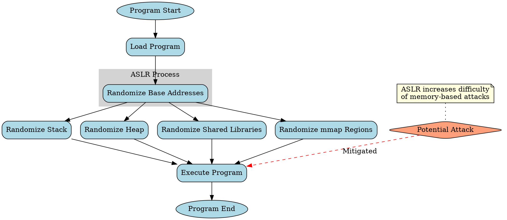

## Table of Contents
1. [Introduction to ASLR](#introduction-to-aslr)
2. [Virtual vs. Physical Addresses](#virtual-vs-physical-addresses)
3. [How ASLR Works](#how-aslr-works)
4. [ASLR Implementation in Different Operating Systems](#aslr-implementation-in-different-operating-systems)
5. [Code Examples and Analysis](#code-examples-and-analysis)
   5.1 [Basic Address Printing](#basic-address-printing)
   5.2 [Stack Address Randomization](#stack-address-randomization)
   5.3 [Heap Address Randomization](#heap-address-randomization)
   5.4 [Shared Library Address Randomization](#shared-library-address-randomization)
6. [Assembly Code Analysis](#assembly-code-analysis)
7. [ASLR Effectiveness and Limitations](#aslr-effectiveness-and-limitations)
8. [ASLR Bypass Techniques](#aslr-bypass-techniques)
9. [Advanced ASLR Techniques](#advanced-aslr-techniques)
10. [Conclusion](#conclusion)

## 1. Introduction to ASLR

Address Space Layout Randomization (ASLR) is a crucial security feature implemented in modern operating systems to protect against various types of memory corruption attacks, such as buffer overflows and return-to-libc attacks. ASLR works by randomly arranging the address space positions of key data areas of a process, including the base of the executable, the stack, heap, and libraries.

The primary goal of ASLR is to introduce unpredictability in the memory layout, making it significantly harder for attackers to reliably jump to specific memory addresses when exploiting vulnerabilities. This randomization occurs each time a program is executed, ensuring that the memory layout differs between runs of the same program.

## 2. Virtual vs. Physical Addresses

Before delving deeper into ASLR, it's essential to understand the distinction between virtual and physical addresses:

- **Virtual Addresses**: These are the addresses that a process sees and uses. They provide an abstraction layer, allowing each process to have its own continuous address space, typically ranging from 0x00000000 to 0xFFFFFFFF on 32-bit systems or 0x0000000000000000 to 0xFFFFFFFFFFFFFFFF on 64-bit systems.

- **Physical Addresses**: These are the actual locations in the computer's RAM where data is stored. The operating system and CPU work together to translate virtual addresses to physical addresses using a mechanism called paging.

This abstraction allows multiple processes to run simultaneously, each thinking it has access to the entire memory space, while the operating system manages the actual physical memory allocation and access.

## 3. How ASLR Works

ASLR operates by introducing randomness into the memory layout of a process. Here's a breakdown of how it works:

1. **Base Address Randomization**: The operating system chooses a random base address for the main executable when it's loaded into memory.

2. **Stack Randomization**: The initial position of the stack is randomized, typically by adding a random offset to the default stack address.

3. **Heap Randomization**: The starting address of the heap is randomized, making it harder to predict where dynamically allocated memory will be located.

4. **Shared Library Randomization**: The base addresses of shared libraries are randomized, ensuring that common libraries are loaded at different addresses for different processes or executions.

5. **Mmap Randomization**: The addresses returned by the mmap system call (used for memory-mapped files and anonymous mappings) are also randomized.

The randomization process typically occurs during the loading of the program, before execution begins. The degree of randomization can vary depending on the operating system and its configuration.



## 4. ASLR Implementation in Different Operating Systems

ASLR has been implemented in various operating systems, each with its own approach:

- **Linux**: Introduced in kernel 2.6.12 (2005) and enabled by default since 2.6.18. Linux implements full ASLR, randomizing the stack, heap, mmap regions, and shared libraries.

- **Windows**: First introduced in Windows Vista (2007) and improved in subsequent versions. Windows implements full ASLR for system binaries and allows applications to opt-in for ASLR.

- **macOS**: Introduced in Mac OS X Leopard (2007). macOS implements ASLR for all system binaries and allows third-party applications to opt-in.

- **OpenBSD**: Pioneered ASLR implementation in 2003, with continuous improvements since then.

Each operating system may have different levels of granularity in its randomization and different methods for enabling or configuring ASLR.

## 5. Code Examples and Analysis

Let's explore ASLR through a series of code examples, each demonstrating a different aspect of address randomization.

### 5.1 Basic Address Printing

First, let's start with a simple C program that prints the addresses of various program elements:

```c
#include <stdio.h>
#include <stdlib.h>

int global_var;

void print_addresses(void) {
    int stack_var;
    int *heap_var = malloc(sizeof(int));

    printf("Text (Code) Segment: %p\n", (void*)print_addresses);
    printf("Data Segment (Global Variable): %p\n", (void*)&global_var);
    printf("Stack (Local Variable): %p\n", (void*)&stack_var);
    printf("Heap (Dynamically Allocated): %p\n", (void*)heap_var);

    free(heap_var);
}

int main() {
    printf("Running with PID: %d\n", getpid());
    print_addresses();
    return 0;
}
```

To compile and run this program:

```bash
gcc -o aslr_demo aslr_demo.c
./aslr_demo
```

Run the program multiple times, and you'll notice that the addresses change between executions due to ASLR.

To view the assembly code:

```bash
gcc -S aslr_demo.c
```

This will generate an `aslr_demo.s` file containing the assembly code. Alternatively, you can use:

```bash
objdump -d aslr_demo > aslr_demo_disassembly.txt
```

This will disassemble the compiled binary and save the output to a text file.

### 5.2 Stack Address Randomization

Let's focus on stack randomization with a more detailed example:

```c
#include <stdio.h>

void print_stack_addresses(int depth) {
    int local_var;
    printf("Stack address at depth %d: %p\n", depth, (void*)&local_var);
    if (depth > 0) {
        print_stack_addresses(depth - 1);
    }
}

int main() {
    printf("Running with PID: %d\n", getpid());
    print_stack_addresses(5);
    return 0;
}
```

Compile and run this program multiple times:

```bash
gcc -o stack_demo stack_demo.c
./stack_demo
```

You'll observe that not only do the stack addresses change between executions, but the relative distances between stack frames remain consistent.

### 5.3 Heap Address Randomization

Now, let's examine heap randomization:

```c
#include <stdio.h>
#include <stdlib.h>

void allocate_and_print(int count) {
    for (int i = 0; i < count; i++) {
        int *ptr = (int*)malloc(sizeof(int));
        printf("Heap allocation %d: %p\n", i + 1, (void*)ptr);
        free(ptr);
    }
}

int main() {
    printf("Running with PID: %d\n", getpid());
    allocate_and_print(5);
    return 0;
}
```

Compile and run:

```bash
gcc -o heap_demo heap_demo.c
./heap_demo
```

You'll notice that heap addresses change between executions, and there's often a pattern to allocations within a single execution.

### 5.4 Shared Library Address Randomization

To demonstrate shared library randomization, we'll create a simple shared library and a program that uses it:

First, create `mylib.c`:

```c
#include <stdio.h>

void print_lib_address() {
    printf("Library function address: %p\n", (void*)print_lib_address);
}
```

Compile it as a shared library:

```bash
gcc -shared -fPIC -o libmylib.so mylib.c
```

Now, create `lib_demo.c`:

```c
#include <stdio.h>

extern void print_lib_address();

int main() {
    printf("Running with PID: %d\n", getpid());
    print_lib_address();
    return 0;
}
```

Compile and run:

```bash
gcc -o lib_demo lib_demo.c -L. -lmylib
export LD_LIBRARY_PATH=.:$LD_LIBRARY_PATH
./lib_demo
```

Run this multiple times to see how the shared library address changes.

## 6. Assembly Code Analysis

Let's analyze some key assembly code sections from our basic address printing example. We'll focus on x86-64 assembly:

```assembly
main:
    push    rbp
    mov     rbp, rsp
    call    getpid
    mov     esi, eax
    mov     edi, OFFSET FLAT:.LC0
    mov     eax, 0
    call    printf
    mov     eax, 0
    call    print_addresses
    mov     eax, 0
    pop     rbp
    ret

print_addresses:
    push    rbp
    mov     rbp, rsp
    sub     rsp, 16
    mov     edi, 4
    call    malloc
    mov     QWORD PTR [rbp-8], rax
    mov     edi, OFFSET FLAT:print_addresses
    call    puts
    mov     rax, QWORD PTR [rbp-8]
    mov     rsi, rax
    mov     edi, OFFSET FLAT:.LC1
    mov     eax, 0
    call    printf
    mov     rax, QWORD PTR [rbp-8]
    mov     rdi, rax
    call    free
    nop
    leave
    ret
```

Key points in this assembly code:

1. `call getpid`: This gets the process ID, which we use to show that we're in a new process each time.
2. `mov edi, OFFSET FLAT:.LC0`: This loads the address of a string constant (likely our format string) into the register for the first argument to printf.
3. `call malloc`: This allocates memory on the heap.
4. `mov QWORD PTR [rbp-8], rax`: This stores the returned heap address on the stack.
5. `call free`: This frees the allocated memory.

The exact addresses used in these instructions will be adjusted by the loader when ASLR is in effect.

## 7. ASLR Effectiveness and Limitations

ASLR significantly increases the difficulty of exploiting memory corruption vulnerabilities, but it's not a panacea:

- **Effectiveness**: ASLR makes it much harder for attackers to predict memory locations, forcing them to either guess (which often crashes the program) or find ways to leak address information.

- **Entropy**: The effectiveness of ASLR depends on the amount of randomization (entropy) possible. 64-bit systems provide much more entropy than 32-bit systems.

- **Partial Overwrites**: In some cases, attackers can overwrite only part of an address, reducing the entropy they need to overcome.

- **Information Leaks**: If an attacker can leak memory addresses, they may be able to defeat ASLR.

- **Repeated Attempts**: On some systems, especially servers, attackers may be able to make repeated attempts to guess the correct addresses.

## 8. ASLR Bypass Techniques

Despite its effectiveness, several techniques have been developed to bypass ASLR:

1. **Return-Oriented Programming (ROP)**: This technique chains together small code snippets (gadgets) already present in the program's memory, potentially bypassing ASLR.

2. **Information Leaks**: Exploiting format string vulnerabilities or other information disclosure bugs can reveal memory addresses.

3. **Heap Spraying**: By allocating many objects with malicious code, attackers increase the chances of guessing a correct address.

4. **Partial Overwrite**: Overwriting only part of an address can sometimes be enough to redirect execution while dealing with less randomization.

5. **Brute Force**: On 32-bit systems or systems allowing many crashes, repeatedly guessing might eventually succeed.

6. **Side-Channel Attacks**: Sophisticated attacks might use timing or other side channels to infer memory layout information.

## 9. Advanced ASLR Techniques

To counter bypass techniques, more advanced forms of ASLR have been developed:

1. **Fine-Grained ASLR**: Randomizes the location of individual functions or even basic blocks within a program.

2. **Re-randomization**: Periodically re-randomizes memory layout during program execution.

3. **Polymorph**: Combines ASLR with instruction set randomization to further increase diversity.

4. **KARL (Kernel Address Randomized Link)**: Randomizes the kernel image at boot time.

5. **KASLR (Kernel Address Space Layout Randomization)**: Extends ASLR principles to the operating system kernel.

## 10. Conclusion

Address Space Layout Randomization is a powerful security technique that has significantly raised the bar for exploiting memory corruption vulnerabilities. By introducing unpredictability into the memory layout of processes, ASLR forces attackers to either expend significantly more effort in crafting reliable exploits or to find alternative attack vectors.

However, ASLR is not a silver bullet. It works best as part of a comprehensive security strategy that includes other techniques such as Data Execution Prevention (DEP), stack canaries, and security-focused coding practices. As attack techniques evolve, so too must defensive measures, leading to ongoing developments in the field of memory protection.

Understanding ASLR and its implications is crucial for both security professionals and software developers. By grasping how ASLR works at a low level, including its interactions with virtual memory and process loading, we can better appreciate its strengths and limitations, and make informed decisions about system security.
