## Introduction

Memory safety vulnerabilities continue to be one of the most critical security issues in systems programming. In this comprehensive guide, we'll explore heap-based vulnerabilities, understand how they occur, and learn methods to prevent them. We'll focus particularly on how improper string handling and memory management can lead to exploitable conditions.

## Understanding the Heap

The heap is a dynamic memory region that allows programs to allocate memory at runtime. Unlike the stack, which follows a strict LIFO (Last In, First Out) order, heap memory can be allocated and freed in any order. This flexibility makes the heap crucial for dynamic data structures but also introduces complexity in memory management.

### Heap Memory Layout

The heap consists of several key components:

1. **Heap Blocks**: Individual chunks of allocated memory
2. **Block Headers**: Metadata preceding each block containing:
   - Size of the block
   - Status flags (allocated/free)
   - Pointers to adjacent blocks
3. **Free Lists**: Linked lists of available memory blocks
4. **Wilderness**: The topmost chunk of the heap that can grow

```mermaid
flowchart TD
    subgraph "Heap Memory Layout"
        A[Heap Start] --> B[Block Header 1]
        B --> C[User Data 1]
        C --> D[Block Header 2]
        D --> E[User Data 2]
        E --> F[More Blocks...]
        F --> G[Wilderness]
    end

    subgraph "Exploitation Process"
        H[Program Start] --> I[Allocate Memory]
        I --> J[Copy User Input]
        J --> K{Buffer Overflow?}
        K -->|Yes| L[Corrupt Adjacent Memory]
        L --> M[Modify Program Flow]
        K -->|No| N[Normal Execution]
    end

    subgraph "Prevention Methods"
        O[Input Validation] --> P[Safe String Functions]
        P --> Q[Bounds Checking]
        Q --> R[Memory Tracking]
        R --> S[Proper Cleanup]
    end
```



## Common Heap Vulnerabilities

### Buffer Overflow in Heap

One of the most common heap vulnerabilities occurs when data is written beyond the bounds of an allocated buffer. Let's examine a vulnerable program:

```c
#include <stdio.h>
#include <stdlib.h>
#include <string.h>

struct user_data {
    int priority;
    char* name;
};

void process_user(char* user_input1, char* user_input2) {
    struct user_data* user1 = malloc(sizeof(struct user_data));
    struct user_data* user2 = malloc(sizeof(struct user_data));
    
    if (!user1 || !user2) {
        printf("Memory allocation failed\n");
        return;
    }

    // Initialize user1
    user1->priority = 1;
    user1->name = malloc(8);  // Only allocate 8 bytes for name
    
    // Initialize user2
    user2->priority = 2;
    user2->name = malloc(8);

    // Vulnerable strcpy operations
    strcpy(user1->name, user_input1);  // No bounds checking
    strcpy(user2->name, user_input2);  // No bounds checking

    printf("User1 priority: %d, name: %s\n", user1->priority, user1->name);
    printf("User2 priority: %d, name: %s\n", user2->priority, user2->name);

    // Clean up
    free(user1->name);
    free(user2->name);
    free(user1);
    free(user2);
}

int main(int argc, char** argv) {
    if (argc != 3) {
        printf("Usage: %s <name1> <name2>\n", argv[0]);
        return 1;
    }
    process_user(argv[1], argv[2]);
    return 0;
}
```

To compile this code:
```bash
gcc -g -o heap_vuln heap_vuln.c
```

The `-g` flag adds debugging information that we'll use later.

### Understanding the Vulnerability

Let's analyze why this code is vulnerable:

1. **Fixed Buffer Size**: We allocate only 8 bytes for each name buffer
2. **Unsafe String Copy**: `strcpy` is used without bounds checking
3. **Adjacent Allocations**: The heap blocks are likely to be adjacent, making overflow possible

### Examining the Assembly

Let's look at the key assembly instructions generated for the vulnerable section:

```bash
gdb ./heap_vuln
(gdb) disassemble process_user
```

Key assembly sections to note:

```nasm
# First malloc call for user1
call   malloc@plt
mov    QWORD PTR [rbp-0x18], rax

# Second malloc call for user1->name
mov    edi, 0x8
call   malloc@plt
mov    rdx, QWORD PTR [rbp-0x18]
mov    QWORD PTR [rdx+0x8], rax

# Vulnerable strcpy
mov    rax, QWORD PTR [rbp-0x18]
mov    rax, QWORD PTR [rax+0x8]
mov    rdx, QWORD PTR [rbp-0x28]
mov    rsi, rdx
mov    rdi, rax
call   strcpy@plt
```

### Exploitation Analysis

When we provide input longer than 8 bytes for the first name, the overflow can corrupt:
1. The heap metadata following the first name buffer
2. The second user struct's data
3. Subsequent heap allocations

## Secure Implementation

Here's a secure version of the same functionality:

```c
#include <stdio.h>
#include <stdlib.h>
#include <string.h>

#define MAX_NAME_LEN 128

struct user_data_safe {
    int priority;
    char* name;
    size_t name_len;
};

void process_user_safe(const char* user_input1, const char* user_input2) {
    struct user_data_safe* user1 = malloc(sizeof(struct user_data_safe));
    struct user_data_safe* user2 = malloc(sizeof(struct user_data_safe));
    
    if (!user1 || !user2) {
        printf("Memory allocation failed\n");
        goto cleanup;
    }

    // Calculate required buffer sizes
    size_t len1 = strnlen(user_input1, MAX_NAME_LEN);
    size_t len2 = strnlen(user_input2, MAX_NAME_LEN);

    // Initialize user1
    user1->priority = 1;
    user1->name = malloc(len1 + 1);
    user1->name_len = len1;
    
    // Initialize user2
    user2->priority = 2;
    user2->name = malloc(len2 + 1);
    user2->name_len = len2;

    if (!user1->name || !user2->name) {
        printf("Memory allocation failed\n");
        goto cleanup;
    }

    // Safe string operations
    strncpy(user1->name, user_input1, len1);
    user1->name[len1] = '\0';
    
    strncpy(user2->name, user_input2, len2);
    user2->name[len2] = '\0';

    printf("User1 priority: %d, name: %s\n", user1->priority, user1->name);
    printf("User2 priority: %d, name: %s\n", user2->priority, user2->name);

cleanup:
    if (user1) {
        free(user1->name);
        free(user1);
    }
    if (user2) {
        free(user2->name);
        free(user2);
    }
}

int main(int argc, char** argv) {
    if (argc != 3) {
        printf("Usage: %s <name1> <name2>\n", argv[0]);
        return 1;
    }
    process_user_safe(argv[1], argv[2]);
    return 0;
}
```

### Security Improvements

1. **Length Tracking**: Added `name_len` to track buffer sizes
2. **Bounds Checking**: Using `strncpy` instead of `strcpy`
3. **Maximum Limits**: Defined `MAX_NAME_LEN` to prevent excessive allocations
4. **Null Termination**: Explicit null termination after string operations
5. **Cleanup Handling**: Added proper cleanup using goto for error cases

## Memory Safety Best Practices

1. **Input Validation**
   - Always validate input lengths
   - Define reasonable maximum sizes
   - Check return values of memory operations

2. **Safe String Functions**
   - Use `strncpy`, `strncat` instead of `strcpy`, `strcat`
   - Consider using safer alternatives like `strlcpy` where available
   - Always ensure proper null termination

3. **Memory Management**
   - Track allocation sizes
   - Use consistent allocation/deallocation patterns
   - Implement proper cleanup in error cases

4. **Defensive Programming**
   - Assume inputs could be malicious
   - Check all return values
   - Use safe defaults

## Advanced Topics

### Heap Exploitation Techniques

1. **Use-After-Free**
   - Accessing freed memory
   - Can lead to arbitrary code execution
   - Prevention: Set pointers to NULL after free

2. **Double Free**
   - Freeing the same memory twice
   - Can corrupt heap management structures
   - Prevention: Track allocation status

3. **Heap Spraying**
   - Filling heap with malicious code
   - Used to increase exploitation reliability
   - Prevention: Memory randomization

### Memory Debugging Tools

1. **Valgrind**
   - Memory leak detection
   - Use-after-free detection
   - Buffer overflow detection

2. **AddressSanitizer**
   - Runtime memory error detector
   - Minimal performance impact
   - Integrated with modern compilers

## Further Reading

1. Common Weakness Enumeration (CWE) Database
   - CWE-122: Heap-based Buffer Overflow
   - CWE-415: Double Free
   - CWE-416: Use After Free

2. OWASP Secure Coding Practices
3. CERT C Coding Standard

## Conclusion

Understanding heap vulnerabilities and implementing proper memory safety measures is crucial for developing secure software. By following best practices and using appropriate tools, many common memory-related vulnerabilities can be prevented.
