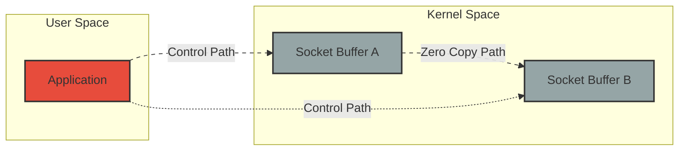

## Introduction

In modern backend systems, performance optimization often comes down to reducing unnecessary data copying and context switches. One of the most significant advancements in this area is zero-copy I/O, particularly when combined with asynchronous I/O interfaces. This post explores these concepts in depth, showing how they can dramatically improve application performance.

## Understanding Traditional I/O Operations

Before diving into zero-copy operations, let's understand why traditional I/O operations can be inefficient. Consider a typical proxy server scenario where data needs to be transferred from one socket to another.

### Traditional I/O Flow:

1. Application reads data from socket A (kernel → user space copy)
2. Application processes the data (if needed)
3. Application writes data to socket B (user space → kernel copy)

This process involves:
- Multiple context switches between user and kernel mode
- At least two copy operations
- CPU cache pollution
- Additional memory allocation and deallocation

Here's a simplified example of traditional socket communication:

```python
def traditional_proxy(source_socket, dest_socket):
    # Allocate buffer in user space
    buffer = bytearray(8192)  # 8KB buffer
    
    while True:
        # Read from source (kernel → user space copy)
        bytes_read = source_socket.recv_into(buffer)
        if not bytes_read:
            break
            
        # Write to destination (user space → kernel copy)
        dest_socket.sendall(buffer[:bytes_read])
```

## Zero-Copy I/O: The Game Changer

Zero-copy I/O eliminates unnecessary data copying between kernel and user space by allowing direct data transfer between file descriptors or sockets within the kernel space.

### Key Benefits:
1. Reduced CPU usage
2. Lower memory bandwidth consumption
3. Improved application performance
4. Reduced latency in data transfer

### Implementation Approaches

#### 1. Using sendfile() System Call

The `sendfile()` system call is one of the earliest zero-copy implementations:

```python
import os

def zero_copy_transfer(src_fd, dest_fd, count):
    # Transfer data directly between file descriptors
    return os.sendfile(dest_fd, src_fd, 0, count)
```

#### 2. Modern Asynchronous I/O with io_uring

Modern Linux systems provide io_uring, which combines zero-copy operations with asynchronous I/O. Here's a conceptual example using Python (requires appropriate bindings):

```python
from pyuring import IoUring, SQE

def setup_io_uring():
    ring = IoUring(32)  # Queue depth of 32
    ring.queue_init()
    return ring

def async_zero_copy_transfer(ring, src_fd, dest_fd, size):
    # Prepare zero-copy transfer
    sqe = ring.get_sqe()
    sqe.prep_send_zero_copy(src_fd, dest_fd, size)
    
    # Submit operation
    ring.submit()
    
    # Get completion
    cqe = ring.wait_cqe()
    return cqe.res

```

## Understanding the Memory Architecture

To grasp why zero-copy is so efficient, we need to understand the memory architecture involved:

### Virtual Memory Layout:
```
+------------------+
| User Space       |
|   Application    |
|   Buffers        |
+------------------+
| Kernel Space     |
|   Socket Buffers |
|   Page Cache     |
+------------------+
```

## Performance Considerations

When implementing zero-copy operations, consider these factors:

1. **Threshold Size**: Zero-copy operations have overhead. For small transfers (typically < 1KB), traditional I/O might be faster.

2. **Memory Mapping**: Consider the trade-off between memory mapping and direct I/O:
```python
def choose_transfer_method(data_size):
    ZERO_COPY_THRESHOLD = 4096  # 4KB
    
    if data_size >= ZERO_COPY_THRESHOLD:
        return "zero_copy"
    return "traditional"
```

3. **Buffer Coalescing**: Combining multiple small buffers into larger ones can improve efficiency:
```python
class BufferCoalescer:
    def __init__(self, threshold=8192):
        self.buffer = bytearray()
        self.threshold = threshold
    
    def add(self, data):
        self.buffer.extend(data)
        if len(self.buffer) >= self.threshold:
            return self.flush()
        return None
    
    def flush(self):
        if not self.buffer:
            return None
        result = bytes(self.buffer)
        self.buffer.clear()
        return result
```

## Real-World Applications

### 1. High-Performance Proxy Servers
```python
class ZeroCopyProxy:
    def __init__(self):
        self.ring = setup_io_uring()
        self.coalescer = BufferCoalescer()
    
    async def handle_connection(self, client_sock, upstream_sock):
        while True:
            data = await self.receive_data(client_sock)
            if not data:
                break
                
            coalesced = self.coalescer.add(data)
            if coalesced:
                await self.zero_copy_send(coalesced, upstream_sock)
```

### 2. Content Delivery Networks (CDNs)
Zero-copy operations are particularly valuable in CDNs where large files need to be served to multiple clients efficiently.

## Measuring Performance

Here's a simple benchmark tool to compare traditional vs. zero-copy transfers:

```python
import time
import statistics

def benchmark_transfer(transfer_func, size, iterations=1000):
    times = []
    
    for _ in range(iterations):
        start = time.perf_counter_ns()
        transfer_func(size)
        end = time.perf_counter_ns()
        times.append(end - start)
    
    return {
        'mean': statistics.mean(times) / 1000,  # Convert to microseconds
        'stddev': statistics.stdev(times) / 1000,
        'median': statistics.median(times) / 1000
    }
```

## Future Developments

The future of zero-copy I/O looks promising with:
- Enhanced hardware support for DMA operations
- Improved kernel interfaces
- Better integration with modern asynchronous I/O frameworks

## Best Practices

1. **Profile First**: Measure your application's I/O patterns before implementing zero-copy operations.
2. **Consider Thresholds**: Implement size-based switching between traditional and zero-copy methods.
3. **Monitor Memory**: Watch for memory pressure when using memory-mapped files.
4. **Error Handling**: Implement robust fallback mechanisms:

```python
class RobustTransfer:
    def __init__(self):
        self.zero_copy_available = check_zero_copy_support()
    
    async def transfer(self, src, dest, size):
        try:
            if self.zero_copy_available and size >= ZERO_COPY_THRESHOLD:
                return await self.zero_copy_transfer(src, dest, size)
        except NotSupportedError:
            self.zero_copy_available = False
        
        return await self.traditional_transfer(src, dest, size)
```

## System Architecture Diagram

Here's a flowchart diagram illustrating the data flow in zero-copy operations:



## Conclusion

Zero-copy I/O represents a significant advancement in system I/O optimization. When properly implemented and combined with modern asynchronous interfaces like io_uring, it can dramatically improve application performance. The key is understanding when and how to use these techniques effectively.

Remember that while zero-copy operations can significantly improve performance, they're not always the best solution. Profile your application, understand your workload patterns, and implement the appropriate optimization strategies based on your specific use case.

For further reading, consider exploring:
- The Linux kernel documentation on io_uring
- Academic papers on zero-copy networking
- Performance optimization guides for modern operating systems

---

*Note: The code examples in this post are simplified for illustration purposes. Production implementations would need additional error handling, proper resource cleanup, and platform-specific considerations.*
