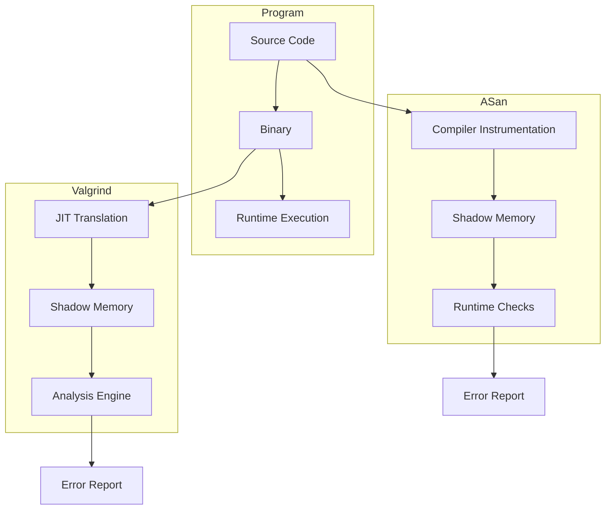

## Table of Contents
1. [Introduction](#introduction)
2. [Understanding Memory Issues](#understanding-memory-issues)
3. [Valgrind Deep Dive](#valgrind-deep-dive)
4. [AddressSanitizer In-Depth](#addresssanitizer-in-depth)
5. [Practical Examples](#practical-examples)
6. [Advanced Usage and Tips](#advanced-usage-and-tips)
7. [Performance Considerations](#performance-considerations)
8. [Tool Comparison](#tool-comparison)
9. [Best Practices](#best-practices)
10. [Architecture Overview](#architecture-overview)

## Introduction

Memory-related bugs are among the most insidious issues in C programming. They can manifest in various ways - from subtle data corruption to catastrophic system crashes. What makes them particularly challenging is that they might not immediately cause visible problems, potentially lying dormant until specific conditions trigger them. This comprehensive guide explores two powerful tools for detecting such issues: Valgrind and AddressSanitizer (ASan).

## Understanding Memory Issues

Before diving into the tools, let's examine common memory-related problems in C programs:

1. Buffer Overflows
2. Use-after-free
3. Memory leaks
4. Uninitialized memory access
5. Stack corruption
6. Double free
7. Invalid free

Let's start with a simple example that demonstrates several of these issues:

```c
#include <stdio.h>
#include <stdlib.h>

void demonstrate_memory_issues() {
    // Buffer overflow on heap
    char* heap_buffer = (char*)malloc(5);
    heap_buffer[5] = 'x';  // Write beyond allocated memory

    // Use after free
    free(heap_buffer);
    heap_buffer[0] = 'y';  // Use after free

    // Memory leak
    int* leak = (int*)malloc(sizeof(int));
    *leak = 42;
    // forgot to free(leak)

    // Stack buffer overflow
    char stack_buffer[5];
    stack_buffer[5] = 'z';  // Write beyond array bounds
}

int main() {
    demonstrate_memory_issues();
    printf("Program completed\n");
    return 0;
}
```

To compile this code:
```bash
gcc -g memory_issues.c -o memory_issues
```

Running this program might appear to work normally, which is exactly what makes memory bugs so dangerous. They can corrupt memory without immediate visible effects.

## Valgrind Deep Dive

### How Valgrind Works

Valgrind operates through dynamic binary instrumentation, meaning it:
1. Reads your program's machine code
2. Translates it into an intermediate representation
3. Adds instrumentation code
4. Translates it back to machine code
5. Executes the instrumented code

This process allows Valgrind to track every memory operation without requiring source code modifications.

### Using Valgrind

Let's create a more complex example to demonstrate Valgrind's capabilities:

```c
#include <stdio.h>
#include <stdlib.h>
#include <string.h>

struct User {
    char* name;
    int age;
};

struct User* create_user(const char* name, int age) {
    struct User* user = (struct User*)malloc(sizeof(struct User));
    // Potential memory leak: not checking if malloc failed
    
    // Buffer overflow: not accounting for null terminator
    user->name = (char*)malloc(strlen(name));
    strcpy(user->name, name);
    
    user->age = age;
    return user;
}

void process_users() {
    struct User* users[3];
    
    users[0] = create_user("Alice", 25);
    users[1] = create_user("Bob", 30);
    users[2] = create_user("Charlie", 35);
    
    // Memory leak: only freeing name, not the struct itself
    for (int i = 0; i < 3; i++) {
        free(users[i]->name);
    }
    
    // Use after free
    printf("%s\n", users[0]->name);
}

int main() {
    process_users();
    return 0;
}
```

To compile and run with Valgrind:
```bash
gcc -g -O0 user_management.c -o user_management
valgrind --leak-check=full --show-leak-kinds=all --track-origins=yes ./user_management
```

The flags used here are:
- `--leak-check=full`: Detailed information about memory leaks
- `--show-leak-kinds=all`: Show all types of leaks
- `--track-origins=yes`: Track the origin of uninitialized values

### Advanced Valgrind Features

Valgrind offers additional tools beyond Memcheck:

1. Cachegrind: Cache and branch prediction profiler
2. Callgrind: Call-graph generating cache profiler
3. Helgrind: Thread error detector
4. DRD: Another thread error detector
5. Massif: Heap profiler

Here's how to use Massif for heap profiling:

```bash
valgrind --tool=massif ./user_management
ms_print massif.out.<pid>
```

## AddressSanitizer In-Depth

### How ASan Works

AddressSanitizer works by:
1. Instrumenting code at compile time
2. Replacing memory allocation functions
3. Creating "shadow memory" to track memory state
4. Adding runtime checks

Let's create an example that showcases ASan's capabilities:

```c
#include <stdio.h>
#include <stdlib.h>
#include <string.h>

void demonstrate_asan_detection() {
    // Stack buffer overflow
    int stack_array[100];
    stack_array[100] = 42;  // One-beyond error
    
    // Heap buffer overflow
    char* heap_array = (char*)malloc(100);
    heap_array[100] = 'x';  // One-beyond error
    
    // Use-after-free
    free(heap_array);
    heap_array[0] = 'y';
    
    // Stack use after return
    int* ptr = NULL;
    {
        int local = 42;
        ptr = &local;
    }
    *ptr = 43;  // Use after return
}

int main() {
    demonstrate_asan_detection();
    return 0;
}
```

To compile with ASan:
```bash
gcc -fsanitize=address -g asan_demo.c -o asan_demo
```

### ASan Runtime Options

ASan provides various runtime options through environment variables:

```bash
# Detect stack use after return
export ASAN_OPTIONS=detect_stack_use_after_return=1

# Custom error logging
export ASAN_OPTIONS=log_path=asan.log:log_exe_name=1

# Increase shadow memory mapping
export ASAN_OPTIONS=quarantine_size_mb=2048
```

## Performance Considerations

Let's compare the performance impact of both tools:

```c
#include <stdio.h>
#include <stdlib.h>
#include <time.h>

#define ARRAY_SIZE 1000000
#define ITERATIONS 100

void benchmark_memory_operations() {
    for (int i = 0; i < ITERATIONS; i++) {
        int* array = (int*)malloc(ARRAY_SIZE * sizeof(int));
        for (int j = 0; j < ARRAY_SIZE; j++) {
            array[j] = j;
        }
        free(array);
    }
}

int main() {
    clock_t start = clock();
    benchmark_memory_operations();
    clock_t end = clock();
    
    double cpu_time_used = ((double) (end - start)) / CLOCKS_PER_SEC;
    printf("Time taken: %f seconds\n", cpu_time_used);
    return 0;
}
```

Compile and run three versions:
```bash
# Normal
gcc -O2 benchmark.c -o benchmark_normal
./benchmark_normal

# With ASan
gcc -O2 -fsanitize=address benchmark.c -o benchmark_asan
./benchmark_asan

# With Valgrind
gcc -O2 benchmark.c -o benchmark_normal
valgrind ./benchmark_normal
```

## Tool Comparison

Here's a side-by-side comparison of key features:

| Feature | Valgrind | AddressSanitizer |
|---------|----------|------------------|
| Compilation Required | No | Yes |
| Performance Impact | 10-50x slowdown | 2-3x slowdown |
| Memory Overhead | Moderate | High |
| Detection Scope | Comprehensive | More focused |
| Integration Effort | Minimal | Requires compilation |
| False Positives | Very few | Very few |

## Best Practices

1. Use both tools in your development workflow
2. Enable debug symbols (-g)
3. Disable optimizations during debugging
4. Use continuous integration
5. Regular memory testing
6. Document known issues
7. Maintain clean baselines

## Architecture Overview

Here's a visualization of how these tools work:


