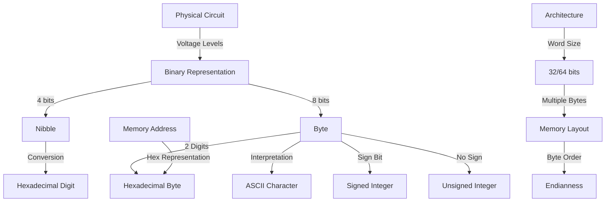

## Introduction

In the realm of computing, understanding number systems and their representations is fundamental to mastering low-level programming and system architecture. This comprehensive guide explores the intricacies of binary and hexadecimal number systems, their practical applications, and their significance in modern computing. We'll understand implementation details, provide practical code examples, and examine the underlying assembly code where relevant.

## Number Systems in Computing
Diagram showing the relationship between different number systems and memory representation:


### The Foundation: Binary

At its core, modern computing is built on binary - a base-2 number system using only 0s and 1s. This isn't an arbitrary choice; it reflects the fundamental nature of electronic circuits where voltage levels represent two distinct states. Let's explore why this matters:

1. **Physical Implementation**
   - Transistors function as switches (ON/OFF states)
   - Voltage thresholds determine binary states
   - Noise immunity is enhanced by having only two states

2. **Basic Units**
   - Bit: Single binary digit (0 or 1)
   - Nibble: 4 bits
   - Byte: 8 bits (modern standard)
   - Word: Architecture-dependent (32 or 64 bits)

Let's implement a program that demonstrates binary operations:

```c
#include <stdio.h>
#include <stdint.h>

void print_binary(uint8_t byte) {
    for (int i = 7; i >= 0; i--) {
        printf("%d", (byte >> i) & 1);
        if (i % 4 == 0) printf(" "); // Space between nibbles
    }
    printf("\n");
}

int main() {
    uint8_t value = 0xA5; // 10100101 in binary

    printf("Value in different representations:\n");
    printf("Decimal: %d\n", value);
    printf("Hexadecimal: 0x%02X\n", value);
    printf("Binary: ");
    print_binary(value);

    // Demonstrate bit operations
    uint8_t left_nibble = (value >> 4) & 0x0F;
    uint8_t right_nibble = value & 0x0F;

    printf("\nLeft nibble: ");
    print_binary(left_nibble);
    printf("Right nibble: ");
    print_binary(right_nibble);

    return 0;
}
```

To compile and run this code:
```bash
gcc -o binary_demo binary_demo.c
./binary_demo
```

Expected output:
```
Value in different representations:
Decimal: 165
Hexadecimal: 0xA5
Binary: 1010 0101

Left nibble: 0000 1010
Right nibble: 0000 0101
```

Let's examine the key assembly instructions generated (x86-64):
```bash
gcc -S binary_demo.c
```

Key assembly sections:
```nasm
# Bit shift operation (value >> 4)
shrb    $4, %al    # Shift right by 4 bits
andb    $15, %al   # Mask with 0x0F

# AND operation (value & 0x0F)
movzbl  -1(%rbp), %eax
andb    $15, %al
```

### The Bridge: Hexadecimal

Hexadecimal (base-16) serves as an human-readable bridge between binary and decimal systems. Here's why it's particularly useful:

1. **Perfect Binary Alignment**
   - Each hex digit represents exactly 4 bits (one nibble)
   - Two hex digits represent one byte
   - Easy visual mapping to binary values

2. **Common Applications**
   - Memory addresses
   - Color codes
   - Binary file representations
   - Network addresses

Let's implement a hex-binary converter with additional features:

```c
#include <stdio.h>
#include <stdint.h>
#include <string.h>

// Conversion tables
const char hex_chars[] = "0123456789ABCDEF";
const uint8_t hex_values[256] = {
    ['0'] = 0,  ['1'] = 1,  ['2'] = 2,  ['3'] = 3,
    ['4'] = 4,  ['5'] = 5,  ['6'] = 6,  ['7'] = 7,
    ['8'] = 8,  ['9'] = 9,  ['A'] = 10, ['B'] = 11,
    ['C'] = 12, ['D'] = 13, ['E'] = 14, ['F'] = 15,
    ['a'] = 10, ['b'] = 11, ['c'] = 12, ['d'] = 13,
    ['e'] = 14, ['f'] = 15
};

void hex_to_binary(const char* hex_str) {
    size_t len = strlen(hex_str);
    printf("Hex: %s\n", hex_str);
    printf("Binary: ");

    for (size_t i = 0; i < len; i++) {
        uint8_t val = hex_values[(unsigned char)hex_str[i]];
        for (int j = 3; j >= 0; j--) {
            printf("%d", (val >> j) & 1);
        }
        printf(" ");
    }
    printf("\n");
}

void binary_to_hex(const char* bin_str) {
    size_t len = strlen(bin_str);
    printf("Binary: %s\n", bin_str);
    printf("Hex: ");

    // Process 4 bits at a time
    for (size_t i = 0; i < len; i += 4) {
        uint8_t val = 0;
        for (int j = 0; j < 4 && (i + j) < len; j++) {
            if (bin_str[i + j] == '1') {
                val |= 1 << (3 - j);
            }
        }
        printf("%c", hex_chars[val]);
    }
    printf("\n");
}

int main() {
    // Test conversions
    printf("Converting hex to binary:\n");
    hex_to_binary("A5");
    printf("\nConverting binary to hex:\n");
    binary_to_hex("10100101");

    return 0;
}
```

To compile and run:
```bash
gcc -o hex_converter hex_converter.c
./hex_converter
```

Expected output:
```
Converting hex to binary:
Hex: A5
Binary: 1010 0101

Converting binary to hex:
Binary: 10100101
Hex: A5
```

## Advanced Topics

### Signed Numbers and Two's Complement

The representation of negative numbers in binary uses two's complement, a clever system that simplifies arithmetic operations. Here's an implementation demonstrating two's complement:

```c
#include <stdio.h>
#include <stdint.h>

void print_bits(int8_t value) {
    for (int i = 7; i >= 0; i--) {
        printf("%d", (value >> i) & 1);
        if (i % 4 == 0) printf(" ");
    }
    printf("\n");
}

int main() {
    int8_t positive = 5;
    int8_t negative = -5;

    printf("Positive 5:\n");
    print_bits(positive);
    printf("Negative 5 (two's complement):\n");
    print_bits(negative);

    // Demonstrate two's complement calculation
    int8_t manual_negative = ~positive + 1;
    printf("Manually calculated -5:\n");
    print_bits(manual_negative);

    return 0;
}
```

### Endianness in Memory

Endianness refers to the order in which bytes are stored in memory. Let's demonstrate this concept:

```c
#include <stdio.h>
#include <stdint.h>

void print_bytes(void* ptr, size_t size) {
    unsigned char* bytes = (unsigned char*)ptr;
    for (size_t i = 0; i < size; i++) {
        printf("%02X ", bytes[i]);
    }
    printf("\n");
}

int main() {
    uint32_t value = 0x12345678;

    printf("32-bit value: 0x%08X\n", value);
    printf("Byte representation in memory: ");
    print_bytes(&value, sizeof(value));

    return 0;
}
```

## System Architecture Considerations

### Memory Alignment

Memory alignment is crucial for performance and correct operation. Here's a demonstration:

```c
#include <stdio.h>
#include <stdint.h>

#pragma pack(1)
struct Unaligned {
    char a;
    int32_t b;
    char c;
};

#pragma pack()
struct Aligned {
    char a;
    int32_t b;
    char c;
};

int main() {
    printf("Unaligned struct size: %zu\n", sizeof(struct Unaligned));
    printf("Aligned struct size: %zu\n", sizeof(struct Aligned));

    return 0;
}
```
## Further Reading
For deeper understanding, consider exploring:

- Computer Architecture: A Quantitative Approach (Hennessy & Patterson)
- The Art of Computer Programming, Volume 2 (Knuth)
- IEEE 754 Standard for Floating-Point Arithmetic
- x86 and x86-64 Instruction Set Architecture documentation

## Conclusion
Understanding number systems and their representations is fundamental to low-level programming and system architecture. The concepts covered here form the foundation for more advanced topics in computer science and engineering. By mastering these basics, you'll be better equipped to tackle complex problems in systems programming, embedded systems, and hardware interfaces.
Remember that while hexadecimal and binary representations might seem cumbersome at first, they become second nature with practice and provide invaluable insights into how computers actually process and store information.
