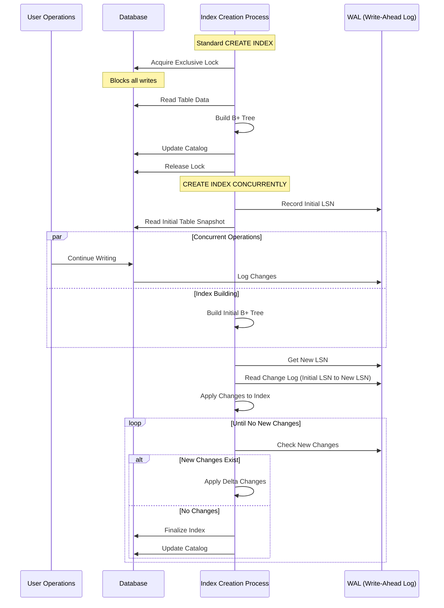

## Introduction

Database indexing is a fundamental concept that significantly impacts application performance. However, creating indexes on production databases presents unique challenges, especially when dealing with concurrent operations. In this comprehensive guide, we'll explore the intricacies of index creation, the challenges of concurrent modifications, and modern solutions to these challenges.

## Table of Contents
1. Understanding Basic Index Creation
2. The Challenge of Concurrent Operations
3. Standard CREATE INDEX vs. CREATE INDEX CONCURRENTLY
4. Implementation Deep Dive
5. Practical Examples with SQL
6. Best Practices and Production Considerations
7. Performance Implications
8. Advanced Concepts and Edge Cases

## 1. Understanding Basic Index Creation

### What is an Index?

An index in a database is essentially a data structure (typically a B+ tree) that provides quick access to rows in a table based on the values in specific columns. Think of it as the index in a book – instead of reading every page to find a topic, you can quickly jump to the relevant section.

### Basic Structure of a B+ Tree Index

A B+ tree index consists of:
- Internal nodes containing keys for navigation
- Leaf nodes containing the indexed values and row pointers
- Balanced structure ensuring consistent performance

### The Basic Creation Process

When creating a basic index, the database must:
1. Read all relevant data from the table
2. Sort the values
3. Build the B+ tree structure
4. Store row pointers (usually ROWIDs or TIDs)
5. Update the system catalog



## 2. The Challenge of Concurrent Operations

### The Fundamental Problem

The primary challenge with index creation comes from the dynamic nature of database operations. While building an index, the underlying data might change due to:
- INSERT operations adding new rows
- UPDATE operations modifying existing values
- DELETE operations removing rows

This creates several potential issues:
- Missing new rows added during index creation
- Indexing modified values that have changed
- Including deleted rows that should no longer exist

### Data Consistency Requirements

For an index to be useful, it must maintain these properties:
1. Completeness: All existing rows must be indexed
2. Accuracy: Index entries must match actual data
3. Consistency: No missing or duplicate entries

## 3. Standard CREATE INDEX vs. CREATE INDEX CONCURRENTLY

### Standard CREATE INDEX

The traditional approach uses exclusive locks:

```sql
CREATE INDEX idx_employee_salary ON employees(salary);
```

This operation:
- Blocks all write operations (INSERT, UPDATE, DELETE)
- Allows read operations to continue
- Provides guaranteed consistency
- Completes faster than concurrent creation

### CREATE INDEX CONCURRENTLY

The modern approach allows concurrent modifications:

```sql
CREATE INDEX CONCURRENTLY idx_employee_salary ON employees(salary);
```

Key differences:
- Allows both read and write operations
- Takes approximately twice as long
- Uses a more complex algorithm
- Requires additional system resources

## 4. Implementation Deep Dive

### Standard Implementation

The traditional index creation process:

```sql
-- Example table
CREATE TABLE employees (
    id SERIAL PRIMARY KEY,
    name VARCHAR(100),
    salary NUMERIC(10,2),
    department VARCHAR(50)
);

-- Standard index creation (blocks writes)
CREATE INDEX idx_salary ON employees(salary);
```

During this operation:
1. The database acquires an exclusive lock
2. Reads begin from the table
3. The B+ tree is constructed
4. The catalog is updated
5. The lock is released

### Concurrent Implementation

The concurrent index creation process is more complex:

```sql
-- Concurrent index creation (allows writes)
CREATE INDEX CONCURRENTLY idx_salary_concurrent ON employees(salary);
```

The process involves:
1. Recording the initial Write-Ahead Log (WAL) position
2. Building initial index structure
3. Tracking changes during construction
4. Applying changes iteratively
5. Finalizing when caught up

## 5. Practical Examples with SQL

Let's explore this with a complete example:

```sql
-- Create a sample table
CREATE TABLE employees (
    id SERIAL PRIMARY KEY,
    name VARCHAR(100),
    salary NUMERIC(10,2),
    department VARCHAR(50)
);

-- Insert sample data
INSERT INTO employees (name, salary, department)
SELECT 
    'Employee ' || i,
    50000 + (random() * 50000)::numeric(10,2),
    CASE (i % 4)
        WHEN 0 THEN 'Engineering'
        WHEN 1 THEN 'Sales'
        WHEN 2 THEN 'Marketing'
        WHEN 3 THEN 'HR'
    END
FROM generate_series(1, 100000) i;

-- Create an index concurrently
CREATE INDEX CONCURRENTLY idx_salary_dept 
ON employees(salary, department);

-- Meanwhile, in another session, these operations can run:
INSERT INTO employees (name, salary, department)
VALUES ('New Employee', 75000, 'Engineering');

UPDATE employees 
SET salary = salary * 1.1 
WHERE department = 'Sales';

DELETE FROM employees 
WHERE salary < 55000;

-- Check index usage
EXPLAIN ANALYZE
SELECT * FROM employees 
WHERE salary BETWEEN 60000 AND 70000 
AND department = 'Engineering';
```

Expected output and behavior:

```sql
-- Before index creation (sequential scan):
Seq Scan on employees
  Filter: (salary >= 60000 AND salary <= 70000 AND department = 'Engineering')
  Rows Removed by Filter: 95234
  Actual time: 15.432..25.678 ms

-- After index creation (index scan):
Index Scan using idx_salary_dept on employees
  Index Cond: (salary >= 60000 AND salary <= 70000 AND department = 'Engineering')
  Actual time: 0.543..1.234 ms
```

## 6. Best Practices and Production Considerations

### When to Use Concurrent Index Creation

Prefer CREATE INDEX CONCURRENTLY when:
- Working on production systems
- Dealing with active OLTP workloads
- Long-running index creation is expected
- System downtime isn't acceptable

### Monitoring Progress

Track index creation progress using system views:

```sql
SELECT schemaname, tablename, indexname, 
       pg_size_pretty(pg_relation_size(schemaname|| '.' ||indexname::text)) as index_size,
       idx_scan as number_of_scans,
       idx_tup_read as tuples_read,
       idx_tup_fetch as tuples_fetched
FROM pg_tables t
LEFT OUTER JOIN pg_class c ON t.tablename=c.relname
LEFT OUTER JOIN pg_indexes i ON c.relname=i.tablename
LEFT OUTER JOIN pg_stat_all_indexes psai ON i.indexname=psai.indexrelname
WHERE schemaname='public' AND indexname = 'idx_salary_dept';
```

## 7. Performance Implications

### Resource Usage

Concurrent index creation requires:
- Additional disk I/O for WAL reading
- More memory for tracking changes
- Extended CPU usage for multiple passes
- Approximately 2x the time of standard creation

### Impact on Other Operations

While allowing concurrent operations, be aware of:
- Slightly reduced write performance
- Increased WAL generation
- Higher overall system load
- Potential for temporary space usage

## 8. Advanced Concepts and Edge Cases

### Handling Failures

If concurrent index creation fails:

```sql
-- Check for invalid indexes
SELECT schemaname, tablename, indexname, 
       pg_get_indexdef(i.indexrelid) as index_definition
FROM pg_indexes i
JOIN pg_class c ON i.indexname = c.relname
WHERE NOT pg_index.indisvalid;

-- Clean up invalid index
DROP INDEX CONCURRENTLY if_exists invalid_index_name;
```

### Partial Indexes with Concurrent Creation

Creating conditional indexes concurrently:

```sql
CREATE INDEX CONCURRENTLY idx_high_salary 
ON employees(salary) 
WHERE salary > 100000;
```

## Conclusion

Understanding the intricacies of database indexing and concurrent operations is crucial for maintaining high-performance database systems. While standard index creation provides simplicity and speed, concurrent index creation offers the flexibility needed in modern, always-on applications. The choice between these approaches depends on your specific requirements for system availability, performance, and resource utilization.

Remember:
1. Always test index creation on staging environments first
2. Monitor system resources during index creation
3. Have a rollback plan ready
4. Consider maintenance windows for standard index creation
5. Use concurrent index creation for production systems when possible

By following these guidelines and understanding the underlying mechanisms, you can effectively manage database indexes while maintaining system availability and performance.
