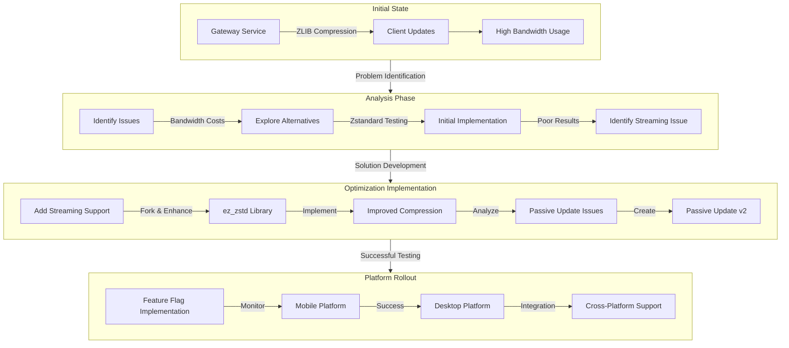

In the world of real-time communication platforms, efficiency isn't just about user experience—it's about sustainability and cost-effectiveness. Discord, one of the leading communication platforms, recently tackled a significant challenge: their real-time communication service was consuming an ever-increasing amount of bandwidth, leading to costs estimated in the hundreds of thousands of dollars. This is the story of how they achieved a remarkable 40% reduction in Gateway bandwidth through careful analysis, testing, and implementation of modern compression techniques.

## Understanding Discord's Gateway Service

Since 2017, Discord has utilized a service called Gateway for providing real-time updates to clients. This service is crucial for maintaining the instant communication capabilities that Discord users have come to expect. Initially, Discord implemented ZLIB compression for Gateway connections, which served them well for several years.

### The ZLIB Implementation

ZLIB, a widely-used data compression library, was Discord's initial choice for compression. It provides lossless compression through a combination of two powerful algorithms:

1. LZ77 Compression: This algorithm operates by maintaining a sliding window of previously seen data and looking ahead for patterns. Here's how it works:
   - Maintains a sliding window of size N for previously processed data
   - Uses a look-ahead window of size M for upcoming data
   - Searches for the longest matching sequences between these windows
   - Outputs either literal characters or references to previous matches

2. Huffman Coding: This complementary compression technique:
   - Analyzes character frequency in the input data
   - Creates a priority queue based on character frequencies
   - Builds a tree structure where common characters get shorter codes
   - Assigns binary codes (0s and 1s) based on the tree traversal

The combination of these techniques provided Discord with decent compression ratios by reducing redundancy through LZ77 and optimizing symbol encoding through Huffman coding.

## The Journey to Zstandard

As Discord's user base grew, the team began exploring alternatives to ZLIB. They identified Zstandard (Zstd) as a promising candidate due to its potential advantages:

### Initial Expectations
- Higher compression ratios
- Faster compression times
- Dictionary support for optimizing similar data patterns
- Better handling of small messages

### The First Attempt

The team's initial approach to testing Zstandard was methodical but revealed unexpected challenges:

1. Testing Methodology:
   - Selected a small subset of traffic for comparison
   - Implemented A/B testing between ZLIB and Zstandard
   - Analyzed compression ratios across different message types

2. Initial Results (Pre-Optimization):
   - User guild setting updates: 
     - ZLIB: 13.95:1 compression ratio
     - Zstandard: 12.26:1 compression ratio
   - Message create payloads:
     - ZLIB: ~250 bytes compressed
     - Zstandard: ~750 bytes compressed

These disappointing results led to a crucial discovery: the importance of streaming compression.

## The Streaming Compression Breakthrough

The team identified that their implementation wasn't utilizing Zstandard's streaming compression capabilities, which was a critical oversight. Streaming compression maintains context across multiple messages, allowing for better optimization based on historical data.

### Technical Challenges

Discord's Gateway service, written in Elixir, faced a significant hurdle: the absence of Elixir bindings that supported Zstandard streaming compression. While the ez_zstd library existed for Erlang, it only supported dictionary compression.

### The Solution

In true open-source spirit, Discord's team:
1. Forked the ez_zstd repository
2. Added streaming support functionality
3. Contributed the enhancement back to the original project

### Improved Results

After implementing streaming compression, the metrics improved dramatically:
- Message create payload compression ratio increased from 6:1 to nearly 10:1
- Average payload size decreased from 270 bytes to 166 bytes
- Compression speed improved significantly:
  - Zstandard: 45 microseconds per byte
  - ZLIB: 100 microseconds per byte

## Discovering Hidden Inefficiencies

During the Zstandard dark launch analysis, the team uncovered another optimization opportunity: the passive update v1 message system.

### The Problem
- These messages represented only 2% of total dispatches
- Yet they consumed 35% of Gateway bandwidth
- They were sending excessive information, including complete lists of channels, members, and voice participants for minor changes

### The Solution: Passive Update v2
- Implemented a new version that only sent required information
- Reduced passive update traffic from 35% to 5% of total Gateway traffic
- Achieved a 20% reduction in cluster-wide bandwidth

## Fine-tuning Zstandard

The team didn't stop at basic implementation. They explored various optimization opportunities:

### Parameter Optimization
Focused on three key parameters:
- Chain lock
- Hash lock
- Window lock

These parameters were carefully balanced to achieve optimal compression while maintaining reasonable memory usage within Gateway node constraints.

### Additional Optimization Attempts

1. Dictionary Compression:
   - Tested using Zstandard's dictionary support
   - Found that the complexity outweighed the modest improvements
   - Decided against implementation

2. Buffer Size Adjustments:
   - Attempted increasing buffer size during off-peak hours
   - Encountered memory fragmentation issues
   - Determined the complexity wasn't worth the limited benefits

## Platform-Wide Implementation

The success of the optimization led Discord to expand the implementation beyond mobile users:

### Cross-Platform Integration
- Android: Integrated Java bindings
- iOS: Implemented Objective-C bindings
- Desktop: Created custom Rust bindings

### Safe Implementation Strategy
1. Feature Flag Implementation:
   - Enabled quick rollback capability
   - Allowed validation of testing results
   - Facilitated monitoring of user experience impact

2. Gradual Rollout:
   - Monitored metrics during deployment
   - Established baseline measurements
   - Ensured no negative impact on user experience

## Final Results and Impact

The culmination of these efforts resulted in:
- 40% reduction in Gateway bandwidth
- Potential savings of hundreds of thousands of dollars annually
- Improved performance across all platforms
- More efficient resource utilization

This optimization project demonstrates the importance of:
- Thorough testing and analysis
- Open-source contribution and collaboration
- Careful implementation and monitoring
- Continuous optimization and improvement

## Looking Forward

Discord's success with this optimization project sets a precedent for future improvements. The team's methodical approach to problem-solving, willingness to contribute to open-source projects, and careful consideration of user experience provides valuable lessons for similar optimization efforts in the tech industry.

## References

1. Discord Engineering Blog - "How Discord Scaled Real-time Communication"
   https://discord.com/blog/how-discord-scaled-elixir-to-5-000-000-concurrent-users

2. Zstandard Documentation - Facebook/Meta Engineering
   https://facebook.github.io/zstd/

3. Real-time Messaging at Scale - Discord Engineering
   https://discord.com/blog/how-discord-maintains-performance-at-scale

4. Erlang Documentation - Streaming Compression Implementation
   https://www.erlang.org/doc/efficiency_guide/advanced.html

5. Discord Developer Documentation - Gateway Protocol
   https://discord.com/developers/docs/topics/gateway
