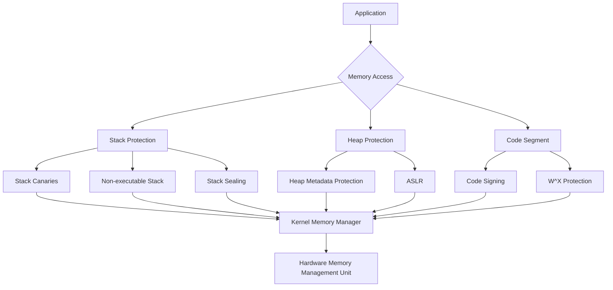

## Table of Contents
1. [Introduction](#introduction)
2. [Understanding Memory Corruption](#understanding-memory-corruption)
3. [Traditional Memory Protection Mechanisms](#traditional-memory-protection-mechanisms)
4. [Advanced Memory Protection](#advanced-memory-protection)
5. [Memory Sealing: A New Approach](#memory-sealing-a-new-approach)
6. [Practical Implementations](#practical-implementations)
7. [Looking to the Future](#looking-to-the-future)
8. [References](#references)
9. [Conclusion](#conclusion)

## Introduction

Memory corruption vulnerabilities continue to be one of the most critical security challenges in modern computing systems. Despite decades of advancement in programming languages and security mechanisms, these vulnerabilities persist as a primary attack vector for system compromises. This comprehensive analysis explores the current state of memory protection mechanisms, focusing on recent developments in kernel-level security features.

## Understanding Memory Corruption

Memory corruption occurs when a program inadvertently modifies memory in an unintended way. Let's examine a classic example of a buffer overflow vulnerability to understand the fundamentals.



### Buffer Overflow Example

Here's a complete, executable program demonstrating a basic buffer overflow:

```c
#include <stdio.h>
#include <string.h>

void vulnerable_function(char* input) {
    char buffer[32];
    // Unsafe function that doesn't check buffer bounds
    strcpy(buffer, input);
    printf("Buffer contains: %s\n", buffer);
}

int main(int argc, char** argv) {
    if (argc != 2) {
        printf("Usage: %s <input_string>\n", argv[0]);
        return 1;
    }
    
    vulnerable_function(argv[1]);
    return 0;
}
```

To compile and run this code:
```bash
gcc -fno-stack-protector -z execstack -o vulnerable_prog vulnerable.c
./vulnerable_prog "AAAA"  # Safe input
./vulnerable_prog "AAAAAAAAAAAAAAAAAAAAAAAAAAAAAAAAAAAAAAAAAA"  # Overflow
```

The `-fno-stack-protector` flag disables stack canaries, and `-z execstack` makes the stack executable for demonstration purposes. Never use these flags in production code.

Let's examine the assembly code generated for the vulnerable_function:

```bash
objdump -d vulnerable_prog | grep -A20 vulnerable_function
```

Key assembly instructions to note:

```nasm
vulnerable_function:
    push    rbp
    mov     rbp, rsp
    sub     rsp, 48         ; Allocate stack space
    mov     QWORD PTR [rbp-8], rdi    ; Store input pointer
    lea     rax, [rbp-40]   ; Buffer location
    mov     rdi, rax        ; Destination for strcpy
    call    strcpy@plt      ; Vulnerable call
    leave
    ret
```

### Understanding the Vulnerability

The vulnerability exists because:
1. No bounds checking is performed before copying
2. Stack memory can be overwritten beyond the allocated buffer
3. Critical stack data (like return addresses) can be corrupted

## Traditional Memory Protection Mechanisms

### Stack Canaries

Stack canaries are random values placed between the buffer and control data. Here's an implementation demonstrating stack canary protection:

```c
#include <stdio.h>
#include <stdlib.h>
#include <time.h>

void __attribute__((constructor)) setup_canary() {
    srand(time(NULL));
}

void check_canary(unsigned long canary, unsigned long original) {
    if (canary != original) {
        fprintf(stderr, "Stack smashing detected!\n");
        exit(1);
    }
}

void protected_function(char* input) {
    unsigned long canary = rand();
    char buffer[32];
    
    // Store canary
    unsigned long *canary_location = (unsigned long*)(buffer + 32);
    *canary_location = canary;
    
    // Perform operation
    strcpy(buffer, input);
    
    // Verify canary
    check_canary(*canary_location, canary);
}

int main(int argc, char** argv) {
    if (argc != 2) {
        printf("Usage: %s <input_string>\n", argv[0]);
        return 1;
    }
    
    protected_function(argv[1]);
    return 0;
}
```

### Non-Executable Memory (NX)

Modern systems implement NX (Non-eXecutable) memory protection. Here's a demonstration of memory permission management:

```c
#include <stdio.h>
#include <sys/mman.h>
#include <string.h>

int main() {
    // Allocate memory with read/write permissions
    void* buffer = mmap(NULL, 4096, 
                       PROT_READ | PROT_WRITE,
                       MAP_PRIVATE | MAP_ANONYMOUS, -1, 0);
    
    if (buffer == MAP_FAILED) {
        perror("mmap failed");
        return 1;
    }
    
    // Write some data
    strcpy(buffer, "Hello, World!");
    
    // Try to make it executable
    if (mprotect(buffer, 4096, PROT_READ | PROT_WRITE | PROT_EXEC) == -1) {
        perror("mprotect failed");
    }
    
    // Clean up
    munmap(buffer, 4096);
    return 0;
}
```

## Advanced Memory Protection

### Memory Sealing Implementation

Here's an example implementation of memory sealing logic (note: this is a conceptual implementation as the actual syscall might not be available):

```c
#include <stdio.h>
#include <sys/mman.h>
#include <errno.h>

// Conceptual implementation of memory sealing
int mseal(void* addr, size_t length, unsigned long flags) {
    // This is a demonstration - actual implementation would be a syscall
    if (addr == NULL || length == 0) {
        errno = EINVAL;
        return -1;
    }
    
    // Mark page as sealed
    struct sealed_page {
        void* start;
        size_t len;
        int sealed;
    } page = {
        .start = addr,
        .len = length,
        .sealed = 1
    };
    
    // In reality, this information would be stored in kernel structures
    printf("Page sealed: %p - %zu bytes\n", page.start, page.len);
    return 0;
}

int main() {
    // Allocate a page of memory
    void* page = mmap(NULL, 4096, 
                     PROT_READ | PROT_WRITE,
                     MAP_PRIVATE | MAP_ANONYMOUS, -1, 0);
    
    if (page == MAP_FAILED) {
        perror("mmap failed");
        return 1;
    }
    
    // Seal the page
    if (mseal(page, 4096, 0) == -1) {
        perror("mseal failed");
        munmap(page, 4096);
        return 1;
    }
    
    // Attempting to modify permissions should now fail
    if (mprotect(page, 4096, PROT_EXEC) == -1) {
        printf("Expected failure: cannot modify sealed page\n");
    }
    
    munmap(page, 4096);
    return 0;
}
```

## Looking to the Future

The evolution of memory protection mechanisms continues to be a critical area of development in system security. While software-based protections provide significant barriers against attacks, the cat-and-mouse game between attackers and defenders persists. Future developments may include:

1. Hardware-assisted memory protection mechanisms
2. Enhanced isolation techniques
3. Improved runtime detection of exploitation attempts

## References
1. The Linux Programming Interface: A System Programming Guide
2. Intel® 64 and IA-32 Architectures Software Developer's Manual
3. Computer Systems: A Programmer's Perspective
4. Linux Kernel Development Documentation

## Conclusion
Memory protection mechanisms continue to evolve as new attack vectors are discovered and exploited. While no single solution provides complete protection, the layered approach of modern systems - combining stack protections, non-executable memory, and new features like memory sealing - creates a robust defense against memory corruption attacks. As we move forward, the integration of hardware-based protection mechanisms and improved software designs will further enhance system security.

The key to effective memory protection lies not in any single mechanism but in the careful combination of multiple layers of defense, each addressing specific types of vulnerabilities while working in concert to provide comprehensive system security.
