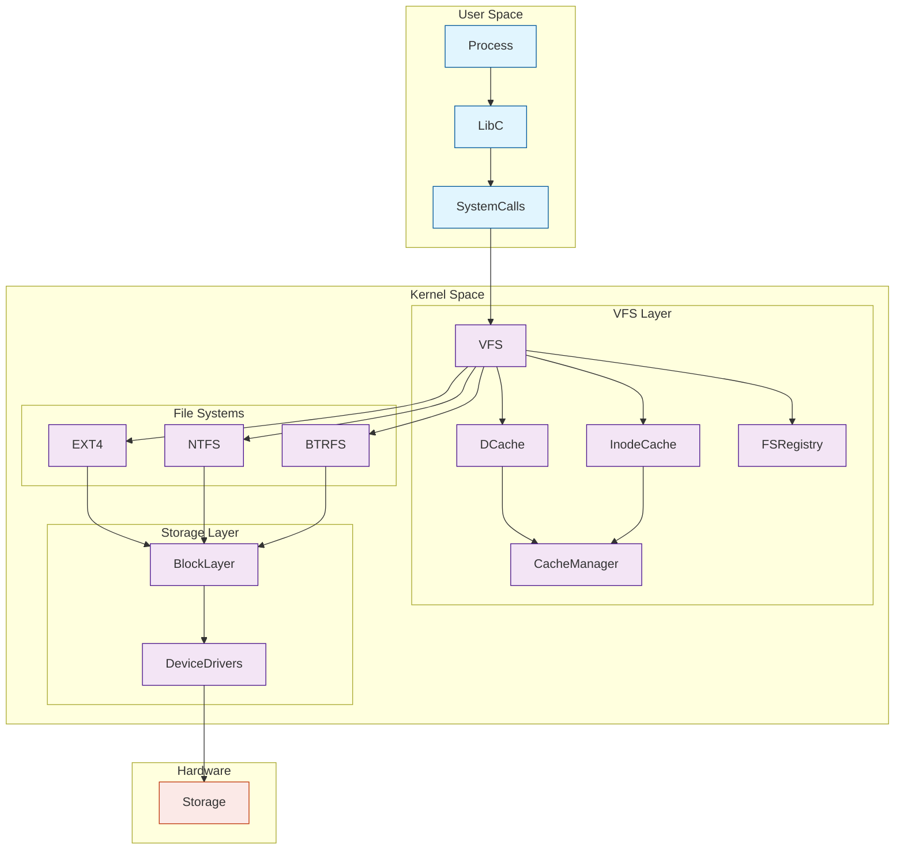

## Table of Contents
1. [Introduction](#introduction)
2. [VFS Architecture](#vfs-architecture)
3. [Core Components](#core-components)
4. [Implementation Details](#implementation-details)
5. [Practical Examples](#practical-examples)
6. [Advanced Concepts](#advanced-concepts)
7. [System Architecture](#system-architecture)

## Introduction

The Virtual File System (VFS) serves as a crucial abstraction layer in modern operating systems, providing a unified interface between user processes and various file systems. This article explores the intricate details of VFS implementation, its evolution, and practical applications in system programming.

## VFS Architecture



### The Abstract Layer

At its core, VFS operates as an abstraction layer that standardizes how different file systems interact with the kernel. This design pattern emerged from the need to support multiple file systems concurrently while maintaining a consistent interface for processes.

The VFS layer implements several key abstractions:

1. **File Objects**: Represent open files within a process
2. **Inodes**: Store metadata about files
3. **Directory Entries**: Cache filesystem hierarchy
4. **Superblocks**: Maintain mounted filesystem information

### System Call Interface

Let's implement a basic system call wrapper to demonstrate how processes interact with VFS:

```c
#include <stdio.h>
#include <fcntl.h>
#include <unistd.h>
#include <errno.h>

typedef struct {
    int fd;
    char *path;
    mode_t mode;
} file_ops_t;

int vfs_open_file(file_ops_t *ops) {
    if (!ops || !ops->path) {
        errno = EINVAL;
        return -1;
    }

    ops->fd = open(ops->path, O_RDWR | O_CREAT, ops->mode);
    if (ops->fd < 0) {
        perror("Failed to open file");
        return -1;
    }

    return ops->fd;
}

int vfs_close_file(file_ops_t *ops) {
    if (!ops || ops->fd < 0) {
        errno = EINVAL;
        return -1;
    }

    if (close(ops->fd) < 0) {
        perror("Failed to close file");
        return -1;
    }

    return 0;
}

int main(void) {
    file_ops_t ops = {
        .fd = -1,
        .path = "/tmp/test_file",
        .mode = 0644
    };

    if (vfs_open_file(&ops) < 0) {
        return 1;
    }

    printf("Successfully opened file with fd: %d\n", ops.fd);
    
    if (vfs_close_file(&ops) < 0) {
        return 1;
    }

    printf("Successfully closed file\n");
    return 0;
}
```

To compile and run this code:
```bash
gcc -Wall -Wextra -o vfs_demo vfs_demo.c
./vfs_demo
```

The assembly output for the main function (x86_64) reveals interesting details about system call handling:

```nasm
main:
    push    rbp
    mov     rbp, rsp
    sub     rsp, 32
    mov     DWORD PTR [rbp-20], -1
    mov     QWORD PTR [rbp-16], OFFSET FLAT:.LC0
    mov     DWORD PTR [rbp-8], 420
    lea     rax, [rbp-20]
    mov     rdi, rax
    call    vfs_open_file
```

## Core Components

### Directory Entry Cache (dcache)

The directory entry cache is a crucial performance optimization in VFS. Let's implement a simple dcache simulator:

```c
#include <stdio.h>
#include <stdlib.h>
#include <string.h>

#define MAX_PATH_LEN 256
#define CACHE_SIZE 1024

typedef struct dentry {
    char name[MAX_PATH_LEN];
    struct dentry *parent;
    unsigned long inode_ptr;
    struct dentry *next;
} dentry_t;

typedef struct {
    dentry_t *entries[CACHE_SIZE];
    size_t count;
} dcache_t;

dcache_t *dcache_create(void) {
    dcache_t *cache = calloc(1, sizeof(dcache_t));
    if (!cache) {
        return NULL;
    }
    return cache;
}

unsigned long hash_path(const char *path) {
    unsigned long hash = 5381;
    int c;
    
    while ((c = *path++)) {
        hash = ((hash << 5) + hash) + c;
    }
    
    return hash % CACHE_SIZE;
}

int dcache_add(dcache_t *cache, const char *path, unsigned long inode) {
    if (!cache || !path) {
        return -1;
    }

    unsigned long hash = hash_path(path);
    dentry_t *entry = malloc(sizeof(dentry_t));
    if (!entry) {
        return -1;
    }

    strncpy(entry->name, path, MAX_PATH_LEN - 1);
    entry->name[MAX_PATH_LEN - 1] = '\0';
    entry->inode_ptr = inode;
    entry->parent = NULL;
    entry->next = cache->entries[hash];
    cache->entries[hash] = entry;
    cache->count++;

    return 0;
}

dentry_t *dcache_lookup(dcache_t *cache, const char *path) {
    if (!cache || !path) {
        return NULL;
    }

    unsigned long hash = hash_path(path);
    dentry_t *current = cache->entries[hash];

    while (current) {
        if (strcmp(current->name, path) == 0) {
            return current;
        }
        current = current->next;
    }

    return NULL;
}

void dcache_destroy(dcache_t *cache) {
    if (!cache) {
        return;
    }

    for (size_t i = 0; i < CACHE_SIZE; i++) {
        dentry_t *current = cache->entries[i];
        while (current) {
            dentry_t *next = current->next;
            free(current);
            current = next;
        }
    }

    free(cache);
}

int main(void) {
    dcache_t *cache = dcache_create();
    if (!cache) {
        fprintf(stderr, "Failed to create dcache\n");
        return 1;
    }

    // Add some entries
    dcache_add(cache, "/usr/bin/python", 12345);
    dcache_add(cache, "/etc/passwd", 67890);

    // Lookup test
    dentry_t *entry = dcache_lookup(cache, "/etc/passwd");
    if (entry) {
        printf("Found entry: %s with inode: %lu\n", 
               entry->name, entry->inode_ptr);
    }

    dcache_destroy(cache);
    return 0;
}
```

To compile and run:
```bash
gcc -Wall -Wextra -o dcache_demo dcache_demo.c
./dcache_demo
```

### Inode Cache

The inode cache maintains frequently accessed file metadata. Here's a simplified implementation:

```c
#include <stdio.h>
#include <stdlib.h>
#include <time.h>

typedef struct {
    unsigned long inode_number;
    mode_t mode;
    uid_t uid;
    gid_t gid;
    time_t atime;
    time_t mtime;
    time_t ctime;
    size_t size;
    unsigned long blocks;
} inode_t;

typedef struct inode_cache_entry {
    inode_t inode;
    struct inode_cache_entry *next;
    int ref_count;
} inode_cache_entry_t;

typedef struct {
    inode_cache_entry_t **buckets;
    size_t size;
} inode_cache_t;

inode_cache_t *create_inode_cache(size_t size) {
    inode_cache_t *cache = malloc(sizeof(inode_cache_t));
    if (!cache) {
        return NULL;
    }

    cache->buckets = calloc(size, sizeof(inode_cache_entry_t*));
    if (!cache->buckets) {
        free(cache);
        return NULL;
    }

    cache->size = size;
    return cache;
}

unsigned long hash_inode(unsigned long inode_number, size_t size) {
    return inode_number % size;
}

int cache_inode(inode_cache_t *cache, inode_t *inode) {
    if (!cache || !inode) {
        return -1;
    }

    unsigned long hash = hash_inode(inode->inode_number, cache->size);
    
    inode_cache_entry_t *entry = malloc(sizeof(inode_cache_entry_t));
    if (!entry) {
        return -1;
    }

    entry->inode = *inode;
    entry->ref_count = 1;
    entry->next = cache->buckets[hash];
    cache->buckets[hash] = entry;

    return 0;
}

inode_t *lookup_inode(inode_cache_t *cache, unsigned long inode_number) {
    if (!cache) {
        return NULL;
    }

    unsigned long hash = hash_inode(inode_number, cache->size);
    inode_cache_entry_t *entry = cache->buckets[hash];

    while (entry) {
        if (entry->inode.inode_number == inode_number) {
            entry->ref_count++;
            return &entry->inode;
        }
        entry = entry->next;
    }

    return NULL;
}

void destroy_inode_cache(inode_cache_t *cache) {
    if (!cache) {
        return;
    }

    for (size_t i = 0; i < cache->size; i++) {
        inode_cache_entry_t *current = cache->buckets[i];
        while (current) {
            inode_cache_entry_t *next = current->next;
            free(current);
            current = next;
        }
    }

    free(cache->buckets);
    free(cache);
}
```

## Advanced Concepts

### File System Registration

Modern VFS implementations maintain a registry of supported file systems. Here's a simplified version:

```c
#include <stdio.h>
#include <stdlib.h>
#include <string.h>

#define MAX_FS_NAME 32

typedef struct filesystem_ops {
    int (*mount)(const char *source, const char *target);
    int (*unmount)(const char *target);
    int (*read)(const char *path, char *buffer, size_t size);
    int (*write)(const char *path, const char *buffer, size_t size);
} filesystem_ops_t;

typedef struct filesystem_type {
    char name[MAX_FS_NAME];
    filesystem_ops_t ops;
    struct filesystem_type *next;
} filesystem_type_t;

typedef struct {
    filesystem_type_t *head;
    size_t count;
} filesystem_registry_t;

filesystem_registry_t *create_fs_registry(void) {
    filesystem_registry_t *registry = malloc(sizeof(filesystem_registry_t));
    if (!registry) {
        return NULL;
    }
    
    registry->head = NULL;
    registry->count = 0;
    return registry;
}

int register_filesystem(filesystem_registry_t *registry, 
                       const char *name, 
                       filesystem_ops_t *ops) {
    if (!registry || !name || !ops) {
        return -1;
    }

    filesystem_type_t *fs_type = malloc(sizeof(filesystem_type_t));
    if (!fs_type) {
        return -1;
    }

    strncpy(fs_type->name, name, MAX_FS_NAME - 1);
    fs_type->name[MAX_FS_NAME - 1] = '\0';
    fs_type->ops = *ops;
    fs_type->next = registry->head;
    registry->head = fs_type;
    registry->count++;

    return 0;
}

filesystem_type_t *lookup_filesystem(filesystem_registry_t *registry, 
                                   const char *name) {
    if (!registry || !name) {
        return NULL;
    }

    filesystem_type_t *current = registry->head;
    while (current) {
        if (strcmp(current->name, name) == 0) {
            return current;
        }
        current = current->next;
    }

    return NULL;
}

void destroy_fs_registry(filesystem_registry_t *registry) {
    if (!registry) {
        return;
    }

    filesystem_type_t *current = registry->head;
    while (current) {
        filesystem_type_t *next = current->next;
        free(current);
        current = next;
    }

    free(registry);
}
```

## Conclusion
Understanding VFS architecture is crucial for system programmers and anyone working with file systems at a low level. The abstractions provided by VFS enable the development of filesystem-agnostic applications while maintaining performance through sophisticated caching mechanisms.
Further Reading

1. Advanced Operating Systems and Implementation
2. Linux Kernel Development (3rd Edition)
3. Understanding the Linux Virtual File System
4. Operating Systems: Three Easy Pieces - File Systems Chapter

## References

1. The Linux Programming Interface
2. Linux System Programming
3. Understanding the Linux Kernel
4. Advanced Linux Programming

**NOTE**: This article provides a simplified view of VFS for educational purposes. Production implementations include additional complexity and optimizations.
