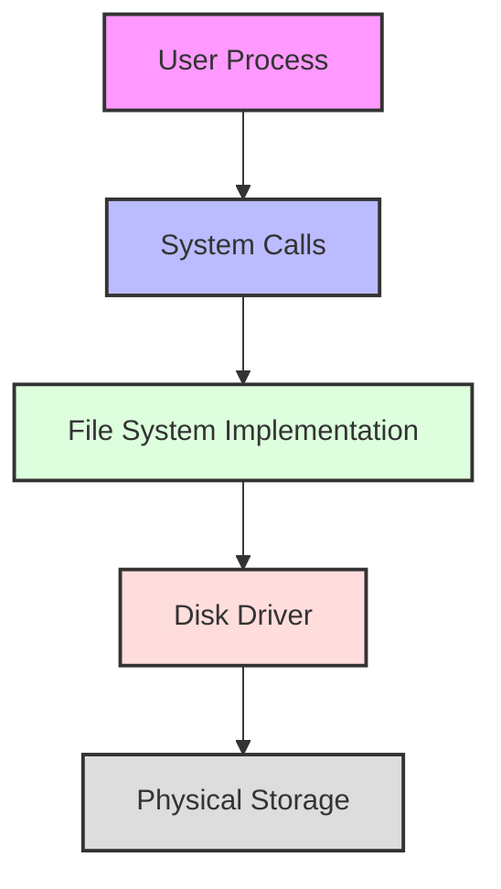
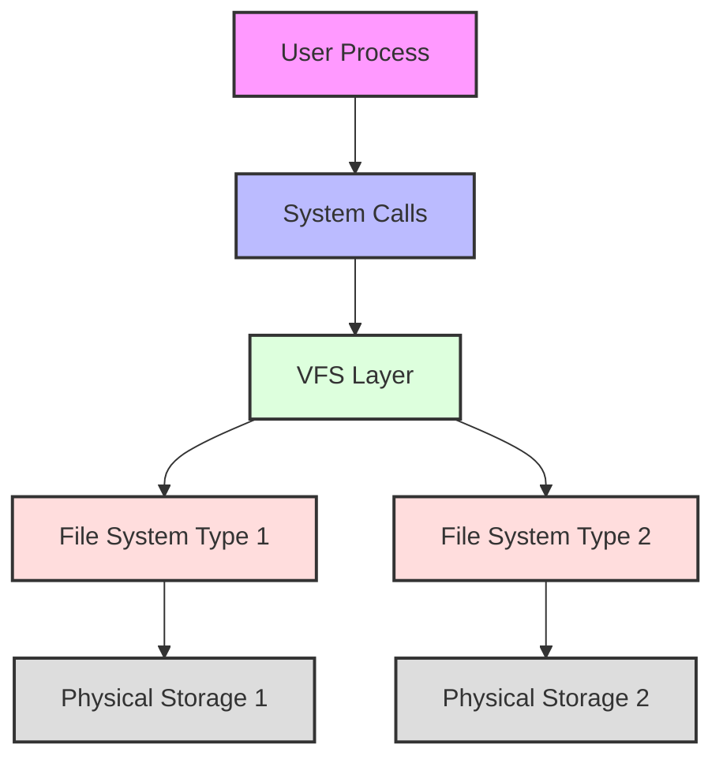
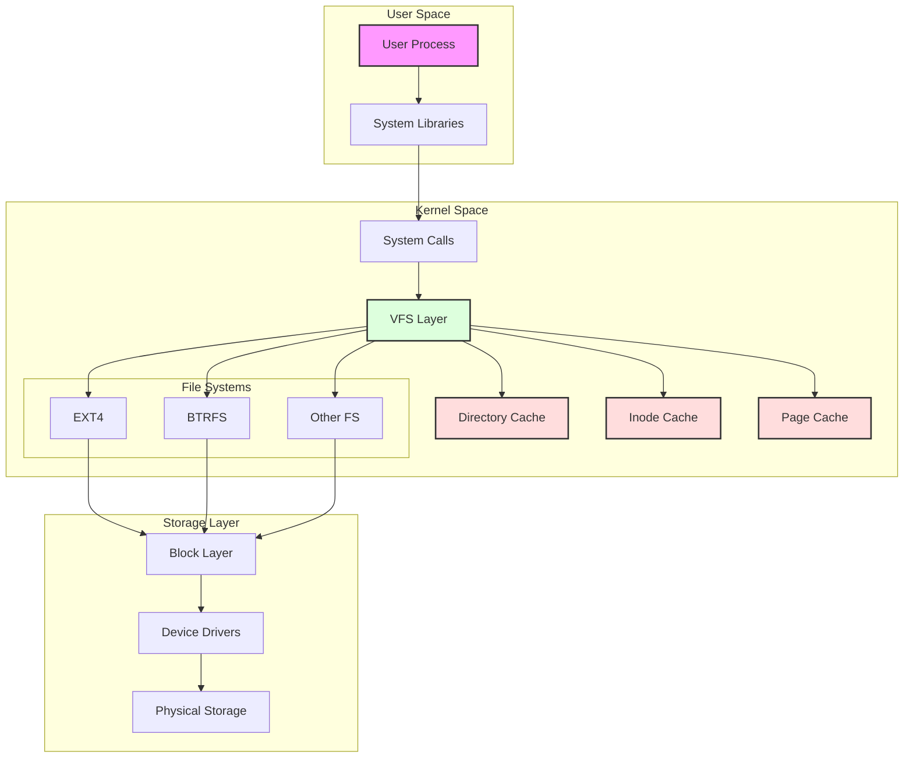
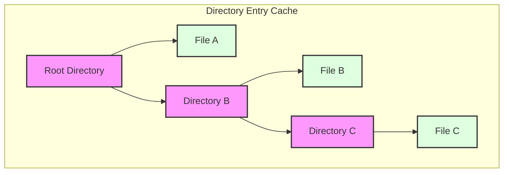
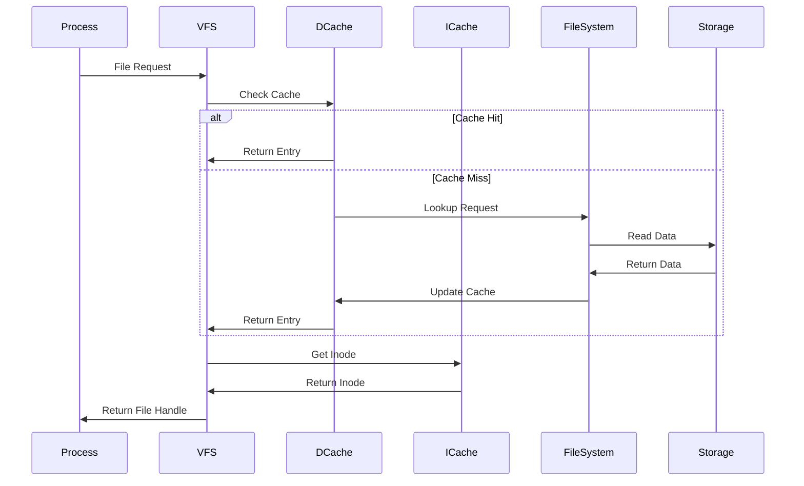
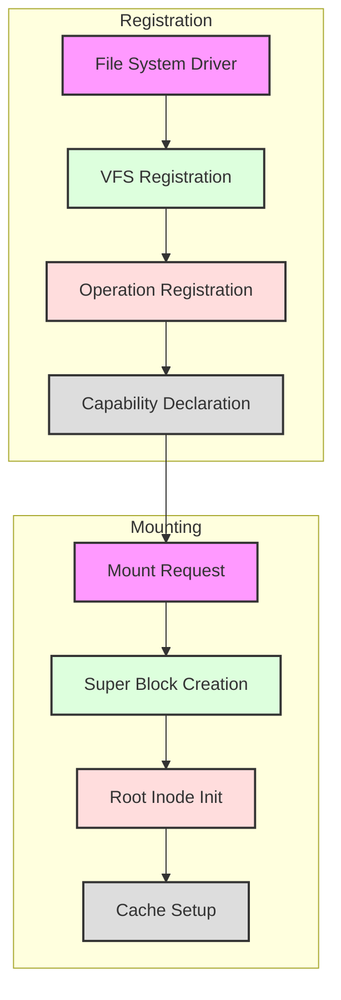

## Introduction

The Virtual File System (VFS) represents one of the most significant architectural components in modern operating systems, serving as the critical bridge between user processes and the underlying storage systems. This article explores the theoretical foundations, evolution, and architectural complexities of VFS, examining both its historical context and modern implementations.

## Historical Context

### Early File System Challenges

In the early days of operating system development, file systems were tightly coupled to the operating system itself. This meant that adding support for a new file system required extensive modifications to the core operating system code. This tight coupling presented several challenges:

1. Limited Extensibility
2. Code Duplication
3. Maintenance Complexity
4. Lack of Standardization

### Pre-VFS Architecture

Let's examine the system architecture before VFS implementation:

In this architecture, processes directly interacted with a single file system implementation, leading to several limitations:

1. Single File System Support
2. No Abstraction Layer
3. Direct Hardware Dependencies
4. Limited Flexibility

## VFS Architecture Evolution

### Early VFS Implementation

The initial VFS implementation introduced a basic abstraction layer that provided:

1. File System Independence
2. Unified System Call Interface
3. Basic Callback Functions

### Modern VFS Architecture

The modern VFS implementation introduces several sophisticated components and concepts:

1. Directory Entry Cache (dcache)
2. Inode Cache
3. Page Cache
4. File Objects
5. Superblocks

## Core Components Analysis

### Directory Entry Cache (dcache)

The directory entry cache serves as a performance optimization mechanism by maintaining a memory-resident structure of the file system hierarchy. It consists of three primary components:

1. **Name**: The file or directory name
2. **Parent Pointer**: Reference to the parent directory
3. **Inode Pointer**: Reference to the associated inode

The dcache structure can be visualized as follows:

### Inode Cache

The inode cache maintains frequently accessed file metadata, including:

1. File Permissions
2. Owner Information
3. Size
4. Timestamps
5. Data Block Pointers

This caching mechanism significantly reduces disk I/O operations by keeping frequently accessed metadata in memory.

### Page Cache

The page cache operates at the lowest level of the caching hierarchy, managing:

1. Recently Read Data
2. Write Buffers
3. Memory-mapped Files
4. Read-ahead Buffers

## VFS Operations Flow

### File Access Flow

When a process requests file access, the following sequence occurs:

1. **Process Initiation**
   - Process makes a system call
   - Library translates to appropriate syscall number

2. **VFS Layer Processing**
   - System call enters VFS layer
   - VFS checks directory cache
   - If not found, initiates file system lookup

3. **Cache Interaction**
   - Checks directory entry cache
   - Verifies inode cache
   - Accesses page cache if needed

4. **File System Operations**
   - Calls appropriate file system driver
   - Translates VFS operations to file system operations
   - Handles any necessary conversions

## File System Registration and Mounting

### Registration Process

File systems must register with VFS to become available for use. This registration process involves:

1. **Driver Registration**
   - File system type registration
   - Operation callback registration
   - Capability declaration

2. **Mount Operations**
   - Super block creation
   - Root inode initialization
   - Cache preparation

## Performance Considerations

### Caching Strategies

The VFS implements multiple caching layers to optimize performance:

1. **Directory Entry Cache**
   - Reduces path lookup operations
   - Maintains frequently accessed paths
   - Optimizes directory traversal

2. **Inode Cache**
   - Reduces metadata reads
   - Maintains file attributes
   - Optimizes permission checks

3. **Page Cache**
   - Reduces disk I/O
   - Implements read-ahead
   - Manages write-back

### Performance Impact

The caching hierarchy significantly impacts system performance:

1. **Reduced Disk I/O**
   - Fewer physical reads
   - Optimized write patterns
   - Better throughput

2. **Improved Response Time**
   - Faster path resolution
   - Quicker metadata access
   - Reduced latency

3. **Resource Management**
   - Memory utilization
   - Cache coherency
   - System responsiveness

## Conclusion

The Virtual File System represents a crucial abstraction layer in modern operating systems, providing:

1. **Unified Interface**
   - Consistent API
   - File system independence
   - Standardized operations

2. **Performance Optimization**
   - Multi-level caching
   - Efficient resource usage
   - Reduced I/O overhead

3. **System Flexibility**
   - Multiple file system support
   - Dynamic mounting
   - Extended functionality

Understanding VFS architecture is essential for:
- Operating system developers
- File system implementers
- System administrators
- Performance engineers

This theoretical foundation provides the basis for practical implementation and optimization of file system operations in modern operating systems.
