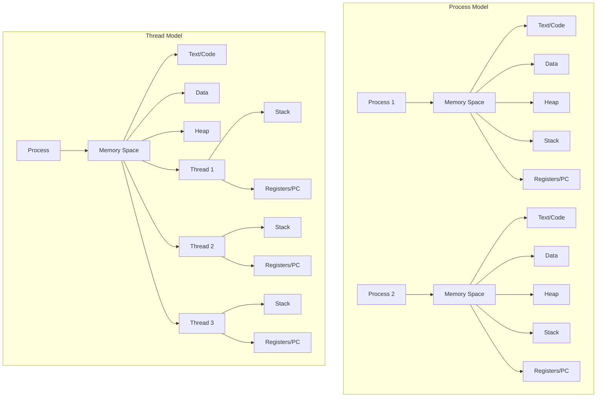
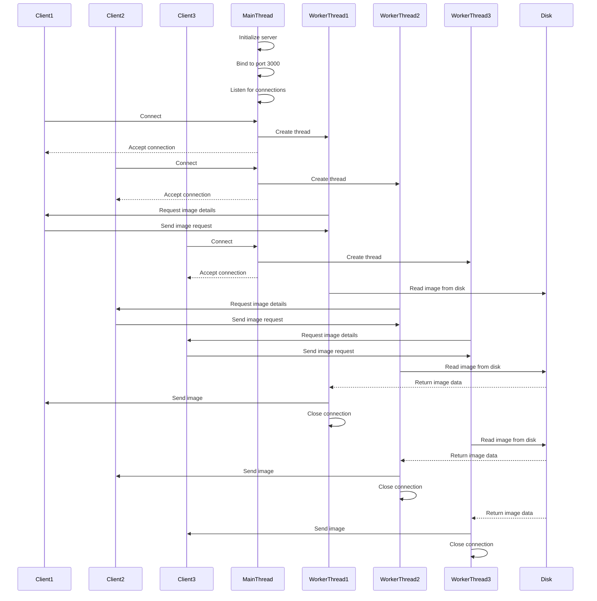

## Table of Contents
1. [Introduction](#introduction)
2. [Fundamentals of Concurrency](#fundamentals-of-concurrency)
   - [The Concept of Concurrency](#the-concept-of-concurrency)
   - [CPU Scheduling and Resource Utilization](#cpu-scheduling-and-resource-utilization)
3. [The Process Model Limitation](#the-process-model-limitation)
   - [Single Program Counter Problem](#single-program-counter-problem)
   - [Why We Need Intra-Process Concurrency](#why-we-need-intra-process-concurrency)
4. [Understanding the Blocking Problem](#understanding-the-blocking-problem)
   - [The Server Example](#the-server-example)
   - [The Multi-Process Solution and Its Drawbacks](#the-multi-process-solution-and-its-drawbacks)
5. [Threads: The Solution](#threads-the-solution)
   - [What Exactly Is a Thread?](#what-exactly-is-a-thread)
   - [Thread Components and Structure](#thread-components-and-structure)
   - [Thread vs. Process Memory Model](#thread-vs-process-memory-model)
6. [Thread Implementation in Operating Systems](#thread-implementation-in-operating-systems)
   - [Task Structure in Linux](#task-structure-in-linux)
   - [Main Thread and Dynamic Thread Creation](#main-thread-and-dynamic-thread-creation)
7. [Practical Implications and Considerations](#practical-implications-and-considerations)
   - [Thread Safety and Shared Resources](#thread-safety-and-shared-resources)
   - [Stack vs. Heap for Thread Communication](#stack-vs-heap-for-thread-communication)
8. [Implementing Multi-threading in C](#implementing-multi-threading-in-c)
   - [Creating and Managing Threads](#creating-and-managing-threads)
   - [Synchronization Mechanisms](#synchronization-mechanisms)
9. [Real-world Example: A Multi-threaded Server](#real-world-example-a-multi-threaded-server)
   - [Implementation Details](#implementation-details)
   - [Performance Analysis](#performance-analysis)
10. [Conclusion](#conclusion)

## Introduction
Have you ever wondered how your computer manages to juggle so many tasks at once—like keeping your browser open, streaming a playlist, and downloading a file, all without breaking a sweat? Or how a single app can handle multiple things, like rendering graphics and responding to your clicks, without tripping over itself? The answer lies in threads, those behind-the-scenes workhorses that make modern software tick. Threads are absolutely everywhere in today’s tech, but let’s face it—they can be a bit of a puzzle, even for seasoned programmers and system designers.

That’s where this post comes in. I want to cut through the confusion and give you a clear, down-to-earth take on what threads are all about. We’ll dig into the essentials, explore how they work under the hood, and see why they’re such a game-changer for building fast, responsive programs. Whether you’re a coding veteran or just starting to peek into the world of operating systems, I’ve got you covered.

So, what’s the plan? We’ll kick things off with the basics of concurrency—think of it as the art of doing multiple things at once. Then, we’ll look at why the old-school approach of using processes wasn’t always up to the task, and how threads swooped in to save the day. By the time we’re done, you’ll not only get how threads function at a low level but also see how you can put them to work in your own projects. Stick with me—it’s going to be practical, straightforward, and maybe even a little fun!

## Fundamentals of Concurrency

### The Concept of Concurrency

Concurrency, at its core, is about managing multiple tasks that progress within overlapping time periods. In a computer system with a single CPU, true simultaneity is impossible—the CPU can execute only one instruction at a time. However, through rapid switching between different execution contexts, the operating system creates the illusion of simultaneity.

This technique is what enables multi-tasking on computers. When you run multiple applications simultaneously—perhaps a web browser, a text editor, and a music player—they aren't truly running at the same time in a single-core system. Instead, the operating system rapidly alternates CPU access between these processes, giving each a small time slice before moving to the next.

The switching happens so rapidly—typically many times per second—that from a human perception standpoint, all processes appear to be running simultaneously. This is concurrency in action, and it's a fundamental feature of modern operating systems.

### CPU Scheduling and Resource Utilization

Beyond enabling multitasking, concurrency serves another critical purpose: maximizing the utilization of computer resources. While a process is often defined as a program in execution, this doesn't mean the process is actively using the CPU at all times, even when allocated CPU time.

Consider what happens when a process initiates an I/O operation, such as reading from disk or waiting for network data. In these scenarios, the CPU would sit idle if it remained allocated to that process, as the process cannot continue executing instructions until the I/O operation completes. This idle time represents wasted computational resources.

CPU scheduling addresses this inefficiency by reallocating the CPU to other processes that are ready to execute while the original process waits for I/O completion. This scheduling strategy fills the gaps when a process can't use the CPU by assigning it to another process that can, thereby maximizing CPU utilization.

The key insight here is that concurrency isn't just about running multiple programs simultaneously—it's equally about ensuring that available computational resources are used as efficiently as possible, even when individual processes encounter operational bottlenecks.

## The Process Model Limitation

### Single Program Counter Problem

Until now, we've considered processes as the fundamental unit of execution in a computer system. Each process represents a program in execution, with its own state including a program counter, registers, and memory space. This model has served computing well for decades, but it has a significant limitation: a process can only do one thing at a time due to having a single program counter.

The program counter (also known as the instruction pointer) keeps track of which instruction the process is executing. When the CPU is reallocated from one process to another, the operating system saves the current value of the program counter so it can be restored later, allowing the process to resume from where it was interrupted.

However, this single program counter means that a process can only keep track of one sequence of instructions at a time. If we want to execute two functions concurrently within the same process, the traditional process model doesn't provide a mechanism for this. One function must wait for the other to complete before it can execute.

This limitation becomes particularly problematic in scenarios where different parts of a program could logically operate independently but are forced to execute sequentially due to the single program counter constraint.

### Why We Need Intra-Process Concurrency

Why would we need concurrency within a process in the first place? Couldn't we just create multiple processes and use inter-process communication (IPC) to coordinate their activities?

While IPC is certainly an option, it's not always the most intuitive or efficient solution. There are many situations where different pieces of code contributing to a common goal are so closely related that placing them in separate processes feels unnatural and introduces unnecessary complexity.

Moreover, processes have significant overhead. Each process requires its own address space, which consumes memory and requires time to set up. Process creation and context switching between processes are relatively expensive operations.

Intra-process concurrency enables us to:
- Execute multiple tasks concurrently without the overhead of creating separate processes
- Share data more easily between concurrent tasks since they exist in the same address space
- Achieve finer-grained concurrency for tasks that logically belong together
- Respond more efficiently to asynchronous events within a single application

These advantages point to the need for a mechanism that enables concurrency within a process without abandoning the process model entirely. This is precisely where threads come into play.

## Understanding the Blocking Problem

### The Server Example

To illustrate the necessity for intra-process concurrency, let's examine a practical example: a server that handles image requests. This server listens on a specific port (e.g., 3000) and its sole purpose is to return profile images associated with clients upon request.

When a client sends a request, the server performs three main steps:
1. Accept the connection request
2. Process the request by locating and reading the image from disk
3. Respond by sending the image back to the client

The second step—reading an image from disk—is an I/O operation that can take significantly longer than simply accepting or responding to the request. I/O operations are notorious for being slow compared to CPU operations, often taking milliseconds rather than nanoseconds.

In a sequential execution model, these steps are executed one after another. For a single client, this approach works fine—the entire operation takes only a few milliseconds. But what happens when multiple clients send requests nearly simultaneously?

### The Multi-Process Solution and Its Drawbacks

If five requests arrive at approximately the same time, the server will accept the first one quickly but then spend significant time processing it before it can even begin to accept the second request. This creates a bottleneck, with later requests waiting a long time to be handled. With just five requests, this might not be a major problem, but imagine a server handling thousands of concurrent requests—the delay becomes substantial.

Looking at this situation from a resource utilization perspective, we can identify periods where the CPU sits idle while the process waits for I/O operations to complete. This is wasted computational time that could have been used to accept and begin processing other client requests.

When one task is unable to execute because another task is running, despite the two being independent, we call this a blocking effect. The traditional solution to this problem has been to create a multi-process architecture:

1. A main process (the "listener") listens for and accepts client requests
2. For each incoming request, the listener creates a new process to handle that specific client
3. The listener immediately returns to accepting new connections

This approach allows the server to take advantage of concurrency, as the process that listens and accepts requests runs concurrently with the processes serving previous clients. This way, new client requests don't have to wait for previous requests to be fully processed before being accepted.

However, this multi-process approach has several significant drawbacks:

- **Memory Overhead**: Each process requires its own address space, which consumes memory. Creating an entire process for every client might work for a few hundred clients, but it becomes inefficient when scaling to thousands.

- **Creation Cost**: Spawning a new process is not a trivial operation; it consumes processing time. Even though the goal is to utilize idle CPU time, a portion of that time is actually spent creating the new process.

- **State Synchronization**: If the server needs to manage some kind of global state, all child processes must be synchronized to keep track of it. This requires some form of IPC, which adds complexity to the implementation.

These limitations highlight the need for a more efficient approach to concurrency—one that provides the benefits of concurrent execution without the overhead of creating and managing multiple processes.

## Threads: The Solution

### What Exactly Is a Thread?

Threads provide an elegant solution to the limitations of the traditional process model. Rather than discarding the concept of a process entirely, threads modify it slightly to allow concurrency within the executable code of a single process.

From the operating system's perspective, threads are what processes were in our previous understanding: the most basic unit of execution. From a developer's perspective, threads are a mechanism to tell the operating system that certain pieces of code inside a program can be executed concurrently.

Another useful definition is that threads are "lightweight processes"—they're easier and faster to create than full processes. This captures the essence of threads as execution units that provide concurrency with less overhead than processes.

It's crucial to understand what a thread is not: a thread is not a function. Any code that a thread executes resides in the text section of the memory layout of the process. The thread doesn't contain code; it points to the code through its program counter. This means multiple threads can point to the exact same executable code, which is what happens in our server example—all handler threads point to the same function in memory.

### Thread Components and Structure

To enable concurrency within a process, we need to overcome the limitation of having a single program counter. The solution is to stop associating the program counter directly with the process and instead assign a program counter to each inner executable entity that we want to run concurrently within the process—these inner entities are threads.

By no longer limiting each process to a single program counter, we can create new threads whenever we need code within the same process to run concurrently. This solves the blocking problem without creating new processes.

Each thread must have:

- **Program Counter**: To keep track of which instruction the thread is executing.
- **Register Set**: To store the CPU state for the thread, including flags, accumulators, etc.
- **Stack Pointer**: Since each thread needs its own stack to manage local variables and function calls.

The thread's own CPU state is essential because threads, like processes, will be interrupted to allocate the CPU to other threads or processes. When a thread is interrupted, its state must be saved so it can be restored when the thread receives CPU time again.

### Thread vs. Process Memory Model

While threads maintain their own CPU state, they share the entire address space of the process they belong to. This is a fundamental difference between threads and processes and is what makes threads "lightweight" compared to processes.

In a multi-process model:
- Each process has its own separate address space
- Processes cannot directly access each other's memory
- Inter-process communication is needed for processes to share data

In a multi-threaded model:
- All threads within a process share the same address space
- Threads can directly access the same global variables and heap memory
- No special mechanisms are needed for threads to share data (though synchronization is still necessary)

This shared memory model has important implications. While each thread has its own stack, the fact that all threads share the same address space means that, technically, one thread could read from or write to another thread's stack. This is generally discouraged unless you really know what you're doing, as it can lead to unpredictable behavior.

For threads within the same process that need to communicate by sharing memory, the heap is more appropriate. By its nature, data stored in the heap is not organized in a predictable stack-like manner, making it better suited for shared access.

## Thread Implementation in Operating Systems

### Task Structure in Linux

Implementing threads requires reimagining the process control block (PCB), the data structure used by operating systems to represent processes. The most obvious approach would be to create a second structure to represent threads, but many modern operating systems take a more elegant approach.

In the Linux kernel, both processes and threads are represented by the same structure called a "task." This is an excellent example of good naming and programming because it abstracts away the distinction between processes and threads. Instead of describing concurrency as alternating CPU access between processes, threads, or both, we can simply describe it as alternating between tasks.

This implementation is more intuitive if we want to use a single scheduler for both threads and processes. It also reflects the reality that threads and processes are conceptually similar—they're both execution contexts that can be scheduled by the operating system.

### Main Thread and Dynamic Thread Creation

Every process has at least one thread, called the main thread. Whenever a new process is created, the operating system automatically creates this thread. Even if a process doesn't explicitly use multi-threading, the operating system can allocate the CPU to it by scheduling its main thread.

Whether a process starts with a fixed number of additional threads or can spawn threads dynamically depends on the operating system's implementation. Most mainstream operating systems prefer the dynamic approach, where each process starts as a single-threaded process, and additional threads can be created at runtime if needed.

This dynamic approach increases the complexity of the operating system's internal implementation, as it must provide system calls for runtime thread creation. However, it's the preferred method because, in many cases, it's impossible to know at compile time how many threads will be needed during execution.

An important consideration in many implementations is that because the main thread identifies the process it belongs to, if it terminates while other threads are still running, those threads will immediately terminate as well. There are multiple ways to handle this situation, but that's beyond the scope of this article.

## Practical Implications and Considerations

### Thread Safety and Shared Resources

While threads provide powerful concurrency capabilities, they also introduce new challenges, particularly around shared resources. When multiple threads access the same memory locations, careful coordination is necessary to avoid race conditions and data corruption.

If one thread is reading from a block of memory while another is writing to it, the results can be unpredictable and potentially disastrous. This is why thread synchronization is so critical that mechanisms for doing so are implemented directly in hardware.

Thread safety concerns arise primarily because threads share the process's global variables and heap memory. Local variables stored on each thread's stack are generally safe from interference by other threads (unless a thread explicitly accesses another thread's stack, which is possible but discouraged).

Executable code and constants, which reside in the text and data sections of memory, are never written to during execution, so threads accessing these memory areas concurrently is perfectly safe. This is why multiple threads can execute the same function without issues—they're all reading from the same memory locations without modifying them.

### Stack vs. Heap for Thread Communication

When threads need to communicate or share data, developers must choose between several approaches:

1. **Global Variables**: These are accessible to all threads but require synchronization mechanisms to prevent race conditions.

2. **Heap Memory**: Dynamically allocated memory on the heap can be shared between threads. Again, synchronization is necessary for safe access.

3. **Thread Local Storage**: Modern programming environments often provide mechanisms for thread-local storage, which allows each thread to have its own copy of certain variables.

4. **Message Passing**: Some threading libraries and languages implement thread communication through message passing rather than shared memory, which can reduce the need for explicit synchronization.

The choice between these approaches depends on the specific requirements of the application and the nature of the data being shared. As a general rule, minimizing shared mutable state makes multi-threaded programming significantly easier and less error-prone.

## Implementing Multi-threading in C

### Creating and Managing Threads

Let's look at how to implement threads in C using the POSIX threads (pthreads) library, which is widely available on Unix-like systems. This practical implementation will help solidify the concepts we've discussed so far.

Here's a basic example of creating threads in C:

```c
#include <stdio.h>
#include <stdlib.h>
#include <pthread.h>
#include <unistd.h>

// Function that will be executed by the thread
void* thread_function(void* arg) {
    int thread_id = *((int*)arg);
    printf("Thread %d is running\n", thread_id);
    
    // Simulate some work
    sleep(2);
    
    printf("Thread %d is finishing\n", thread_id);
    return NULL;
}

int main() {
    pthread_t threads[5];
    int thread_args[5];
    int i, ret;
    
    // Create five threads
    for (i = 0; i < 5; i++) {
        thread_args[i] = i;
        ret = pthread_create(&threads[i], NULL, thread_function, &thread_args[i]);
        
        if (ret) {
            printf("Error creating thread %d: %d\n", i, ret);
            exit(EXIT_FAILURE);
        }
        printf("Created thread %d\n", i);
    }
    
    // Wait for all threads to complete
    for (i = 0; i < 5; i++) {
        ret = pthread_join(threads[i], NULL);
        if (ret) {
            printf("Error joining thread %d: %d\n", i, ret);
            exit(EXIT_FAILURE);
        }
        printf("Joined thread %d\n", i);
    }
    
    printf("All threads have completed\n");
    return 0;
}
```

In this example:
- We include the `pthread.h` header to access the POSIX threads API.
- We define a function `thread_function` that will be executed by each thread.
- In `main()`, we create an array of five thread identifiers and arguments.
- We use `pthread_create()` to create each thread, passing it a pointer to the thread function and an argument.
- We use `pthread_join()` to wait for each thread to complete before continuing.

Notice that when creating a thread, we pass a pointer to a function as an argument to `pthread_create()`. This aligns with our earlier explanation: threads don't contain code; they point to code through their program counter. What we're doing here is passing the memory address where the code that the thread will execute begins.

### Synchronization Mechanisms

When multiple threads access shared resources, synchronization is necessary to prevent race conditions. POSIX threads provide several synchronization mechanisms:

```c
#include <stdio.h>
#include <stdlib.h>
#include <pthread.h>
#include <unistd.h>

#define NUM_THREADS 5
#define INCREMENT_PER_THREAD 1000000

// Shared variable
long counter = 0;

// Mutex for protecting the shared counter
pthread_mutex_t counter_mutex;

// Function that will be executed by each thread
void* increment_counter(void* arg) {
    int thread_id = *((int*)arg);
    
    for (int i = 0; i < INCREMENT_PER_THREAD; i++) {
        // Lock the mutex before accessing the shared resource
        pthread_mutex_lock(&counter_mutex);
        
        // Critical section - access to the shared resource
        counter++;
        
        // Unlock the mutex
        pthread_mutex_unlock(&counter_mutex);
    }
    
    printf("Thread %d completed its increments\n", thread_id);
    return NULL;
}

int main() {
    pthread_t threads[NUM_THREADS];
    int thread_args[NUM_THREADS];
    int i, ret;
    
    // Initialize the mutex
    pthread_mutex_init(&counter_mutex, NULL);
    
    // Create threads
    for (i = 0; i < NUM_THREADS; i++) {
        thread_args[i] = i;
        ret = pthread_create(&threads[i], NULL, increment_counter, &thread_args[i]);
        
        if (ret) {
            printf("Error creating thread %d: %d\n", i, ret);
            exit(EXIT_FAILURE);
        }
    }
    
    // Wait for all threads to complete
    for (i = 0; i < NUM_THREADS; i++) {
        ret = pthread_join(threads[i], NULL);
        if (ret) {
            printf("Error joining thread %d: %d\n", i, ret);
            exit(EXIT_FAILURE);
        }
    }
    
    // Destroy the mutex
    pthread_mutex_destroy(&counter_mutex);
    
    printf("Expected final counter value: %d\n", NUM_THREADS * INCREMENT_PER_THREAD);
    printf("Actual final counter value: %ld\n", counter);
    
    return 0;
}
```

In this example:
- We define a shared counter variable that all threads will increment.
- We create a mutex to protect access to this shared resource.
- Each thread executes the `increment_counter` function, incrementing the counter a large number of times.
- Before accessing the counter, each thread locks the mutex, ensuring exclusive access.
- After modifying the counter, each thread unlocks the mutex, allowing other threads to access it.
- Without this synchronization, race conditions would occur, and the final counter value would likely be incorrect.

This example demonstrates the use of mutexes, one of the most common synchronization primitives. Other synchronization mechanisms provided by POSIX threads include condition variables, read-write locks, and barriers, each serving different synchronization needs.

## Real-world Example: A Multi-threaded Server

### Implementation Details

Let's implement a simplified version of our image server example using threads. This will demonstrate how threads can be used to handle multiple client requests concurrently without the overhead of creating multiple processes.

```c
#include <stdio.h>
#include <stdlib.h>
#include <string.h>
#include <unistd.h>
#include <pthread.h>
#include <sys/socket.h>
#include <netinet/in.h>
#include <arpa/inet.h>
#include <fcntl.h>
#include <sys/stat.h>

#define PORT 3000
#define BUFFER_SIZE 1024
#define MAX_CLIENTS 100

// Structure to pass data to threads
typedef struct {
    int client_socket;
    struct sockaddr_in client_addr;
} client_data;

// Function prototypes
void* handle_client(void* arg);
void send_file(int client_socket, const char* filename);

int main() {
    int server_socket, client_socket;
    struct sockaddr_in server_addr, client_addr;
    socklen_t client_len = sizeof(client_addr);
    pthread_t threads[MAX_CLIENTS];
    client_data* client_data_array[MAX_CLIENTS];
    int thread_count = 0;
    
    // Create socket
    server_socket = socket(AF_INET, SOCK_STREAM, 0);
    if (server_socket == -1) {
        perror("Failed to create socket");
        exit(EXIT_FAILURE);
    }
    
    // Set socket options to reuse address
    int opt = 1;
    if (setsockopt(server_socket, SOL_SOCKET, SO_REUSEADDR, &opt, sizeof(opt)) < 0) {
        perror("setsockopt failed");
        exit(EXIT_FAILURE);
    }
    
    // Configure server address
    memset(&server_addr, 0, sizeof(server_addr));
    server_addr.sin_family = AF_INET;
    server_addr.sin_addr.s_addr = INADDR_ANY;
    server_addr.sin_port = htons(PORT);
    
    // Bind socket to address
    if (bind(server_socket, (struct sockaddr*)&server_addr, sizeof(server_addr)) < 0) {
        perror("Bind failed");
        exit(EXIT_FAILURE);
    }
    
    // Listen for connections
    if (listen(server_socket, 10) < 0) {
        perror("Listen failed");
        exit(EXIT_FAILURE);
    }
    
    printf("Server started on port %d\n", PORT);
    
    // Accept and handle client connections
    while (1) {
        // Accept a new client connection
        client_socket = accept(server_socket, (struct sockaddr*)&client_addr, &client_len);
        if (client_socket < 0) {
            perror("Accept failed");
            continue;
        }
        
        printf("New connection accepted from %s:%d\n", 
               inet_ntoa(client_addr.sin_addr), ntohs(client_addr.sin_port));
        
        // Prepare data for the new thread
        client_data_array[thread_count] = (client_data*)malloc(sizeof(client_data));
        client_data_array[thread_count]->client_socket = client_socket;
        client_data_array[thread_count]->client_addr = client_addr;
        
        // Create a new thread to handle the client
        if (pthread_create(&threads[thread_count], NULL, handle_client, 
                          (void*)client_data_array[thread_count]) != 0) {
            perror("Failed to create thread");
            close(client_socket);
            free(client_data_array[thread_count]);
            continue;
        }
        
        // Detach the thread so we don't need to wait for it
        pthread_detach(threads[thread_count]);
        
        thread_count++;
        if (thread_count >= MAX_CLIENTS) {
            // Reuse thread slots from the beginning
            thread_count = 0;
        }
    }
    
    // Close the server socket (never reached in this simple example)
    close(server_socket);
    return 0;
}

// Thread function to handle a client connection
void* handle_client(void* arg) {
    client_data* data = (client_data*)arg;
    int client_socket = data->client_socket;
    struct sockaddr_in client_addr = data->client_addr;
    char buffer[BUFFER_SIZE];
    ssize_t bytes_received;
    
    // Receive the client's request
    bytes_received = recv(client_socket, buffer, BUFFER_SIZE - 1, 0);
    if (bytes_received > 0) {
        // Null-terminate the received data
        buffer[bytes_received] = '\0';
        
        // Simple parsing to extract the requested image filename
        // In a real server, proper HTTP parsing would be done
        char* filename_start = strstr(buffer, "GET /");
        if (filename_start) {
            filename_start += 5; // Skip "GET /"
            char* filename_end = strchr(filename_start, ' ');
            if (filename_end) {
                *filename_end = '\0';
                
                // Prepend "images/" directory to the filename
                char full_path[BUFFER_SIZE];
                snprintf(full_path, BUFFER_SIZE, "images/%s", filename_start);
                
                printf("Client %s:%d requested file: %s\n", 
                       inet_ntoa(client_addr.sin_addr), 
                       ntohs(client_addr.sin_port), 
                       full_path);
                
                // Send the requested file
                send_file(client_socket, full_path);
            }
        }
    }
    
    // Close the client socket and free the data structure
    close(client_socket);
    free(data);
    
    return NULL;
}

// Function to send a file to the client
void send_file(int client_socket, const char* filename) {
    int file_fd;
    struct stat file_stat;
    off_t offset = 0;
    char header[BUFFER_SIZE];
    char buffer[BUFFER_SIZE];
    ssize_t bytes_sent, bytes_read;
    
    // Open the requested file
    file_fd = open(filename, O_RDONLY);
    if (file_fd == -1) {
        // File not found, send a 404 response
        snprintf(header, BUFFER_SIZE, 
                "HTTP/1.1 404 Not Found\r\n"
                "Content-Type: text/plain\r\n"
                "Content-Length: 13\r\n"
                "\r\n"
                "File not found");
        
        send(client_socket, header, strlen(header), 0);
        return;
    }
    
    // Get file size
    if (fstat(file_fd, &file_stat) < 0) {
        close(file_fd);
        return;
    }
    
    // Send HTTP header
    snprintf(header, BUFFER_SIZE, 
            "HTTP/1.1 200 OK\r\n"
            "Content-Type: image/jpeg\r\n"
            "Content-Length: %ld\r\n"
            "\r\n", 
            file_stat.st_size);
    
    send(client_socket, header, strlen(header), 0);
    
    // Send file content
    while ((bytes_read = read(file_fd, buffer, BUFFER_SIZE)) > 0) {
        bytes_sent = send(client_socket, buffer, bytes_read, 0);
        if (bytes_sent < 0) {
            break;
        }
    }
    
    // Close the file
    close(file_fd);
}
```

This multi-threaded server:
1. Creates a socket and binds it to port 3000
2. Listens for incoming client connections
3. For each new connection, creates a new thread to handle the client
4. Each thread receives the client's request, processes it by reading an image file from disk, and sends the file back to the client
5. After sending the file, the thread closes the client connection and terminates

The main thread immediately returns to accepting new connections after creating a handler thread, allowing the server to handle multiple clients concurrently.

### Performance Analysis

The multi-threaded approach offers several advantages over both single-threaded and multi-process designs:

1. **Improved Responsiveness**: New clients don't have to wait for previous requests to be fully processed before being accepted.

2. **Efficient Resource Utilization**: When one thread is waiting for I/O, the CPU can be allocated to other threads that are ready to execute.

3. **Lower Memory Overhead**: Threads share the same address space, consuming less memory than an equivalent multi-process design.

4. **Faster Context Switching**: Switching between threads is generally faster than switching between processes.

5. **Simplified Communication**: Threads can directly share data through global variables or the heap, without requiring IPC mechanisms.

However, the multi-threaded approach also has potential limitations:

1. **Thread Safety Concerns**: Care must be taken to synchronize access to shared resources.

2. **Scalability Limits**: Creating too many threads can lead to increased contention for CPU time and other resources.

3. **Complexity**: Multi-threaded programming introduces additional complexity in terms of design, debugging, and testing.

The optimal approach depends on the specific requirements of the application, the expected load, and the available system resources. Modern server designs often employ hybrid approaches, such as thread pools, to balance the benefits of multi-threading with the need to limit resource consumption.

## Conclusion

Threads represent a fundamental concept in operating system design and concurrent programming. By enabling concurrency within a process, threads provide a powerful mechanism for maximizing resource utilization, improving application responsiveness, and simplifying the implementation of concurrent systems.

We've explored the core concepts of threads, from their definition as the most basic unit of execution to their implementation in operating systems like Linux. We've seen how threads differ from processes in terms of their memory model and resource requirements, and we've examined practical examples of multi-threaded programming in C.

Key takeaways from this exploration include:

- Threads provide concurrency without the overhead of creating separate processes
- Each thread has its own program counter, register set, and stack, but shares the address space of its parent process
- The shared memory model simplifies communication between threads but introduces the need for synchronization
- - Thread creation and management involve less overhead than process creation
- Modern operating systems like Linux represent both processes and threads as "tasks"
- Effective multi-threaded programming requires careful consideration of thread safety and synchronization

As we continue to move towards more concurrent and parallel computing paradigms, a deep understanding of threads and their implementation becomes increasingly important. Whether you're developing high-performance server applications, responsive user interfaces, or leveraging multi-core processors, threads provide the foundation for modern concurrent programming.

## Thread Visualizations

Let's visualize the concepts we've discussed to better understand how threads operate within a process and how they compare to the multi-process model:



Now, let's visualize how a multi-threaded server handles concurrent requests:



## Thread Synchronization Deep Dive
Thread synchronization ensures data consistency when multiple threads access shared resources. Let's explore some common synchronization mechanisms in more detail:

### Mutex (Mutual Exclusion)
A mutex is a synchronization primitive that prevents multiple threads from simultaneously accessing a shared resource. It's like a lock that only one thread can hold at a time.

```c
#include <stdio.h>
#include <stdlib.h>
#include <pthread.h>
#include <unistd.h>

#define NUM_THREADS 5

pthread_mutex_t mutex;
int shared_counter = 0;

void* increment_function(void* arg) {
    int thread_id = *((int*)arg);
    
    for (int i = 0; i < 5; i++) {
        // Lock the mutex before accessing the shared resource
        pthread_mutex_lock(&mutex);
        
        // Critical section
        shared_counter++;
        printf("Thread %d: Counter = %d\n", thread_id, shared_counter);
        
        // Simulate some work
        usleep(100000);  // Sleep for 100ms
        
        // Unlock the mutex
        pthread_mutex_unlock(&mutex);
        
        // Non-critical section
        usleep(200000);  // Sleep for 200ms
    }
    
    return NULL;
}

int main() {
    pthread_t threads[NUM_THREADS];
    int thread_ids[NUM_THREADS];
    
    // Initialize the mutex
    pthread_mutex_init(&mutex, NULL);
    
    // Create threads
    for (int i = 0; i < NUM_THREADS; i++) {
        thread_ids[i] = i;
        pthread_create(&threads[i], NULL, increment_function, &thread_ids[i]);
    }
    
    // Wait for threads to complete
    for (int i = 0; i < NUM_THREADS; i++) {
        pthread_join(threads[i], NULL);
    }
    
    // Destroy the mutex
    pthread_mutex_destroy(&mutex);
    
    printf("Final counter value: %d\n", shared_counter);
    return 0;
}
```

### Semaphores
Semaphores are more versatile than mutexes. While a mutex can only be locked by one thread at a time, a semaphore can allow multiple threads to access a resource concurrently, up to a specified limit.

```c
#include <stdio.h>
#include <stdlib.h>
#include <pthread.h>
#include <semaphore.h>
#include <unistd.h>

#define NUM_THREADS 5
#define MAX_CONCURRENT 2  // Maximum number of threads allowed in critical section

sem_t semaphore;
int active_threads = 0;
pthread_mutex_t count_mutex;

void* resource_function(void* arg) {
    int thread_id = *((int*)arg);
    
    printf("Thread %d is trying to access the resource\n", thread_id);
    
    // Wait on the semaphore
    sem_wait(&semaphore);
    
    // Critical section - resource access
    pthread_mutex_lock(&count_mutex);
    active_threads++;
    printf("Thread %d entered critical section. Active threads: %d\n", 
           thread_id, active_threads);
    pthread_mutex_unlock(&count_mutex);
    
    // Simulate work inside critical section
    sleep(2);
    
    pthread_mutex_lock(&count_mutex);
    active_threads--;
    printf("Thread %d leaving critical section. Active threads: %d\n", 
           thread_id, active_threads);
    pthread_mutex_unlock(&count_mutex);
    
    // Release the semaphore
    sem_post(&semaphore);
    
    return NULL;
}

int main() {
    pthread_t threads[NUM_THREADS];
    int thread_ids[NUM_THREADS];
    
    // Initialize the semaphore
    sem_init(&semaphore, 0, MAX_CONCURRENT);
    
    // Initialize the mutex
    pthread_mutex_init(&count_mutex, NULL);
    
    // Create threads
    for (int i = 0; i < NUM_THREADS; i++) {
        thread_ids[i] = i;
        pthread_create(&threads[i], NULL, resource_function, &thread_ids[i]);
        // Small delay to make output more readable
        usleep(100000);
    }
    
    // Wait for threads to complete
    for (int i = 0; i < NUM_THREADS; i++) {
        pthread_join(threads[i], NULL);
    }
    
    // Cleanup
    sem_destroy(&semaphore);
    pthread_mutex_destroy(&count_mutex);
    
    return 0;
}
```

### Condition Variables
Condition variables allow threads to wait until a specific condition occurs. They're often used in producer-consumer scenarios.

```c
#include <stdio.h>
#include <stdlib.h>
#include <pthread.h>
#include <unistd.h>

#define BUFFER_SIZE 5
#define NUM_ITEMS 20

pthread_mutex_t mutex;
pthread_cond_t buffer_not_full;
pthread_cond_t buffer_not_empty;

int buffer[BUFFER_SIZE];
int count = 0;  // Number of items in the buffer
int in = 0;     // Index for next produce
int out = 0;    // Index for next consume

void* producer(void* arg) {
    int producer_id = *((int*)arg);
    
    for (int i = 0; i < NUM_ITEMS; i++) {
        // Generate an item
        int item = producer_id * 100 + i;
        
        // Lock the mutex
        pthread_mutex_lock(&mutex);
        
        // Wait while the buffer is full
        while (count == BUFFER_SIZE) {
            printf("Producer %d: Buffer full, waiting...\n", producer_id);
            pthread_cond_wait(&buffer_not_full, &mutex);
        }
        
        // Add item to buffer
        buffer[in] = item;
        in = (in + 1) % BUFFER_SIZE;
        count++;
        
        printf("Producer %d: Produced item %d, count now %d\n", 
               producer_id, item, count);
        
        // Signal that the buffer is not empty
        pthread_cond_signal(&buffer_not_empty);
        
        // Unlock the mutex
        pthread_mutex_unlock(&mutex);
        
        // Simulate variable production time
        usleep(rand() % 500000);
    }
    
    return NULL;
}

void* consumer(void* arg) {
    int consumer_id = *((int*)arg);
    
    for (int i = 0; i < NUM_ITEMS; i++) {
        // Lock the mutex
        pthread_mutex_lock(&mutex);
        
        // Wait while the buffer is empty
        while (count == 0) {
            printf("Consumer %d: Buffer empty, waiting...\n", consumer_id);
            pthread_cond_wait(&buffer_not_empty, &mutex);
        }
        
        // Remove item from buffer
        int item = buffer[out];
        out = (out + 1) % BUFFER_SIZE;
        count--;
        
        printf("Consumer %d: Consumed item %d, count now %d\n", 
               consumer_id, item, count);
        
        // Signal that the buffer is not full
        pthread_cond_signal(&buffer_not_full);
        
        // Unlock the mutex
        pthread_mutex_unlock(&mutex);
        
        // Simulate variable consumption time
        usleep(rand() % 800000);
    }
    
    return NULL;
}

int main() {
    pthread_t producer_thread, consumer_thread;
    int producer_id = 1;
    int consumer_id = 1;
    
    // Initialize random seed
    srand(time(NULL));
    
    // Initialize mutex and condition variables
    pthread_mutex_init(&mutex, NULL);
    pthread_cond_init(&buffer_not_full, NULL);
    pthread_cond_init(&buffer_not_empty, NULL);
    
    // Create threads
    pthread_create(&producer_thread, NULL, producer, &producer_id);
    pthread_create(&consumer_thread, NULL, consumer, &consumer_id);
    
    // Wait for threads to complete
    pthread_join(producer_thread, NULL);
    pthread_join(consumer_thread, NULL);
    
    // Cleanup
    pthread_mutex_destroy(&mutex);
    pthread_cond_destroy(&buffer_not_full);
    pthread_cond_destroy(&buffer_not_empty);
    
    return 0;
}
```

### Thread Pools
Creating and destroying threads has overhead. Thread pools maintain a collection of pre-created threads that can be assigned tasks as needed, reducing this overhead.

```c
#include <stdio.h>
#include <stdlib.h>
#include <pthread.h>
#include <unistd.h>

#define POOL_SIZE 3
#define QUEUE_SIZE 10

// Task structure
typedef struct {
    void (*function)(void*);
    void* argument;
} task_t;

// Thread pool structure
typedef struct {
    pthread_mutex_t lock;
    pthread_cond_t notify;
    pthread_t threads[POOL_SIZE];
    task_t* queue[QUEUE_SIZE];
    int queue_size;
    int head;
    int tail;
    int count;
    int shutdown;
} threadpool_t;

// Function prototypes
threadpool_t* threadpool_create();
void threadpool_destroy(threadpool_t* pool);
int threadpool_add_task(threadpool_t* pool, void (*function)(void*), void* argument);
void* threadpool_thread(void* threadpool);

// Create a thread pool
threadpool_t* threadpool_create() {
    threadpool_t* pool = (threadpool_t*)malloc(sizeof(threadpool_t));
    if (pool == NULL) {
        return NULL;
    }
    
    // Initialize pool attributes
    pool->queue_size = 0;
    pool->head = 0;
    pool->tail = 0;
    pool->count = 0;
    pool->shutdown = 0;
    
    // Initialize mutex and condition variable
    pthread_mutex_init(&(pool->lock), NULL);
    pthread_cond_init(&(pool->notify), NULL);
    
    // Create worker threads
    for (int i = 0; i < POOL_SIZE; i++) {
        pthread_create(&(pool->threads[i]), NULL, threadpool_thread, (void*)pool);
    }
    
    return pool;
}

// Add task to the thread pool
int threadpool_add_task(threadpool_t* pool, void (*function)(void*), void* argument) {
    if (pool == NULL || function == NULL) {
        return -1;
    }
    
    // Lock the mutex
    pthread_mutex_lock(&(pool->lock));
    
    // Check if the queue is full
    if (pool->count == QUEUE_SIZE) {
        pthread_mutex_unlock(&(pool->lock));
        return -1;
    }
    
    // Check if shutting down
    if (pool->shutdown) {
        pthread_mutex_unlock(&(pool->lock));
        return -1;
    }
    
    // Add task to queue
    task_t* task = (task_t*)malloc(sizeof(task_t));
    task->function = function;
    task->argument = argument;
    
    pool->queue[pool->tail] = task;
    pool->tail = (pool->tail + 1) % QUEUE_SIZE;
    pool->count++;
    
    // Signal waiting thread
    pthread_cond_signal(&(pool->notify));
    
    pthread_mutex_unlock(&(pool->lock));
    
    return 0;
}

// Thread worker function
void* threadpool_thread(void* threadpool) {
    threadpool_t* pool = (threadpool_t*)threadpool;
    task_t* task;
    
    while (1) {
        pthread_mutex_lock(&(pool->lock));
        
        // Wait for a task if the queue is empty and not shutting down
        while ((pool->count == 0) && (!pool->shutdown)) {
            pthread_cond_wait(&(pool->notify), &(pool->lock));
        }
        
        // Check for shutdown
        if (pool->shutdown) {
            pthread_mutex_unlock(&(pool->lock));
            pthread_exit(NULL);
        }
        
        // Get a task from the queue
        task = pool->queue[pool->head];
        pool->queue[pool->head] = NULL;
        pool->head = (pool->head + 1) % QUEUE_SIZE;
        pool->count--;
        
        pthread_mutex_unlock(&(pool->lock));
        
        // Execute the task
        (*(task->function))(task->argument);
        free(task);
    }
    
    return NULL;
}

// Destroy the thread pool
void threadpool_destroy(threadpool_t* pool) {
    if (pool == NULL) {
        return;
    }
    
    // Lock the mutex
    pthread_mutex_lock(&(pool->lock));
    
    // Set shutdown flag
    pool->shutdown = 1;
    
    // Signal all threads
    pthread_cond_broadcast(&(pool->notify));
    
    pthread_mutex_unlock(&(pool->lock));
    
    // Wait for threads to exit
    for (int i = 0; i < POOL_SIZE; i++) {
        pthread_join(pool->threads[i], NULL);
    }
    
    // Free remaining tasks in queue
    while (pool->count > 0) {
        free(pool->queue[pool->head]);
        pool->head = (pool->head + 1) % QUEUE_SIZE;
        pool->count--;
    }
    
    // Destroy mutex and condition variable
    pthread_mutex_destroy(&(pool->lock));
    pthread_cond_destroy(&(pool->notify));
    
    // Free pool structure
    free(pool);
}

// Example task function
void task_function(void* arg) {
    int task_id = *((int*)arg);
    printf("Task %d started\n", task_id);
    sleep(1);  // Simulate work
    printf("Task %d completed\n", task_id);
    free(arg);
}

int main() {
    // Create thread pool
    threadpool_t* pool = threadpool_create();
    
    // Add tasks to the pool
    for (int i = 0; i < 10; i++) {
        int* task_id = (int*)malloc(sizeof(int));
        *task_id = i;
        printf("Adding task %d to the pool\n", i);
        threadpool_add_task(pool, task_function, task_id);
    }
    
    // Allow tasks to execute
    sleep(5);
    
    // Destroy the pool
    threadpool_destroy(pool);
    
    return 0;
}
```

### Thread Local Storage
Thread Local Storage (TLS) allows each thread to have its own copy of a variable, avoiding the need for synchronization in some cases.

```c
#include <stdio.h>
#include <stdlib.h>
#include <pthread.h>
#include <unistd.h>

#define NUM_THREADS 3
#define ITERATIONS 3

// Thread-specific key
pthread_key_t thread_specific_key;

// Destructor for thread-specific data
void destructor(void* data) {
    if (data) {
        printf("Freeing thread-specific data: %d\n", *((int*)data));
        free(data);
    }
}

void* thread_function(void* arg) {
    int thread_id = *((int*)arg);
    
    // Allocate thread-specific data
    int* data = (int*)malloc(sizeof(int));
    *data = thread_id * 100;
    
    // Set thread-specific data
    pthread_setspecific(thread_specific_key, data);
    
    for (int i = 0; i < ITERATIONS; i++) {
        // Get and modify thread-specific data
        int* tls_data = (int*)pthread_getspecific(thread_specific_key);
        (*tls_data)++;
        
        printf("Thread %d: TLS data = %d\n", thread_id, *tls_data);
        
        sleep(1);
    }
    
    return NULL;
}

int main() {
    pthread_t threads[NUM_THREADS];
    int thread_ids[NUM_THREADS];
    
    // Create key for thread-specific data
    pthread_key_create(&thread_specific_key, destructor);
    
    // Create threads
    for (int i = 0; i < NUM_THREADS; i++) {
        thread_ids[i] = i;
        pthread_create(&threads[i], NULL, thread_function, &thread_ids[i]);
    }
    
    // Wait for threads to complete
    for (int i = 0; i < NUM_THREADS; i++) {
        pthread_join(threads[i], NULL);
    }
    
    // Delete key
    pthread_key_delete(thread_specific_key);
    
    return 0;
}
```

## Advanced Topic
### Reader-Writer Locks
Reader-writer locks allow multiple readers to access a resource simultaneously but only one writer at a time, with no readers present.

```c
#include <stdio.h>
#include <stdlib.h>
#include <pthread.h>
#include <unistd.h>

#define NUM_READERS 3
#define NUM_WRITERS 2
#define READ_ITERATIONS 5
#define WRITE_ITERATIONS 3

// Shared data
int shared_data = 0;

// Read-write lock
pthread_rwlock_t rwlock;

void* reader_function(void* arg) {
    int reader_id = *((int*)arg);
    
    for (int i = 0; i < READ_ITERATIONS; i++) {
        // Acquire read lock
        pthread_rwlock_rdlock(&rwlock);
        
        // Read shared data
        printf("Reader %d: Read shared_data = %d\n", reader_id, shared_data);
        
        // Simulate reading time
        usleep(rand() % 500000);
        
        // Release read lock
        pthread_rwlock_unlock(&rwlock);
        
        // Wait before next read
        usleep(rand() % 300000);
    }
    
    return NULL;
}

void* writer_function(void* arg) {
    int writer_id = *((int*)arg);
    
    for (int i = 0; i < WRITE_ITERATIONS; i++) {
        // Acquire write lock
        pthread_rwlock_wrlock(&rwlock);
        
        // Modify shared data
        shared_data = writer_id * 100 + i;
        printf("Writer %d: Set shared_data = %d\n", writer_id, shared_data);
        
        // Simulate writing time
        usleep(rand() % 1000000);
        
        // Release write lock
        pthread_rwlock_unlock(&rwlock);
        
        // Wait before next write
        usleep(rand() % 800000);
    }
    
    return NULL;
}

int main() {
    pthread_t readers[NUM_READERS];
    pthread_t writers[NUM_WRITERS];
    int reader_ids[NUM_READERS];
    int writer_ids[NUM_WRITERS];
    
    // Initialize random seed
    srand(time(NULL));
    
    // Initialize read-write lock
    pthread_rwlock_init(&rwlock, NULL);
    
    // Create reader threads
    for (int i = 0; i < NUM_READERS; i++) {
        reader_ids[i] = i;
        pthread_create(&readers[i], NULL, reader_function, &reader_ids[i]);
    }
    
    // Create writer threads
    for (int i = 0; i < NUM_WRITERS; i++) {
        writer_ids[i] = i;
        pthread_create(&writers[i], NULL, writer_function, &writer_ids[i]);
    }
    
    // Wait for reader threads to complete
    for (int i = 0; i < NUM_READERS; i++) {
        pthread_join(readers[i], NULL);
    }
    
    // Wait for writer threads to complete
    for (int i = 0; i < NUM_WRITERS; i++) {
        pthread_join(writers[i], NULL);
    }
    
    // Destroy read-write lock
    pthread_rwlock_destroy(&rwlock);
    
    return 0;
}
```

**This article covers:**
- Core concepts of threads and their importance in operating systems
- The evolution from process-based to thread-based concurrency
- Thread implementation details, including memory models and scheduling
- Practical code examples in C using POSIX threads
- Advanced synchronization mechanisms (mutexes, semaphores, condition variables)
- Thread pools and thread-local storage implementations
- Visual representations of thread vs. process models and request handling
