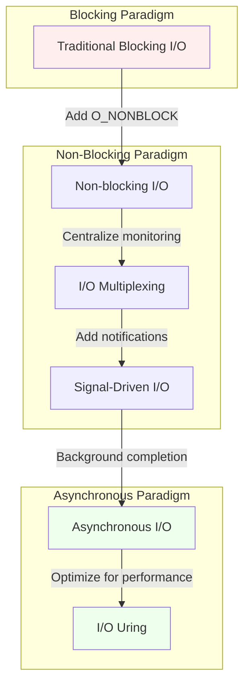

# Table of Contents

- [Introduction](#introduction)
  - [Overview of System Calls](#overview-of-system-calls)
  - [Importance of Distinguishing Fast vs. Slow System Calls](#importance-of-distinguishing-fast-vs-slow-system-calls)

- [Core Definitions: Fast vs. Slow System Calls](#core-definitions-fast-vs-slow-system-calls)
  - [Fast System Calls](#fast-system-calls)
  - [Slow System Calls](#slow-system-calls)

- [The Signal Interaction Mechanism](#the-signal-interaction-mechanism)
  - [How Signals Work with Blocked System Calls](#how-signals-work-with-blocked-system-calls)
  - [Example Scenario](#example-scenario)

- [Code Demonstration](#code-demonstration)
  - [Practical Example: read() with Signal Handling](#practical-example-read-with-signal-handling)
  - [How to Compile and Run the Code](#how-to-compile-and-run-the-code)
  - [Expected Output and Explanation](#expected-output-and-explanation)

- [Gray Areas: The Case of Disk I/O](#gray-areas-the-case-of-disk-io)
  - [Disk I/O as a Gray Area](#disk-io-as-a-gray-area)
  - [Practical Example: Disk Read with Signal Handling](#practical-example-disk-read-with-signal-handling)
  - [How to Compile and Run the Disk I/O Example](#how-to-compile-and-run-the-disk-io-example)
  - [Expected Output and Explanation](#expected-output-and-explanation)

- [System Call Categories in Detail](#system-call-categories-in-detail)
  - [Non-blocking System Calls (Fast)](#non-blocking-system-calls-fast)
  - [Potentially Blocking System Calls (Medium)](#potentially-blocking-system-calls-medium)
  - [Indefinitely Blocking System Calls (Slow)](#indefinitely-blocking-system-calls-slow)

- [Kernel Implementation Details](#kernel-implementation-details)
  - [Fast System Call Implementation](#fast-system-call-implementation)
  - [Slow System Call Implementation](#slow-system-call-implementation)

- [Signal Handling in the Kernel](#signal-handling-in-the-kernel)
  - [Signal Processing Workflow](#signal-processing-workflow)
  - [Automatic System Call Restart](#automatic-system-call-restart)
  - [Practical Example: SA_RESTART Demonstration](#practical-example-sa_restart-demonstration)
  - [How to Compile and Run the SA_RESTART Example](#how-to-compile-and-run-the-sa_restart-example)
  - [Expected Output and Explanation](#expected-output-and-explanation)

- [Practical Applications and Best Practices](#practical-applications-and-best-practices)
  - [Signal Handler Design](#signal-handler-design)
  - [Handling EINTR](#handling-eintr)
  - [Using Non-blocking I/O](#using-non-blocking-io)
  - [Using Asynchronous I/O](#using-asynchronous-io)

- [Understanding System Call Implementation at a Lower Level](#understanding-system-call-implementation-at-a-lower-level)
  - [Fast System Call: getpid()](#fast-system-call-getpid)
  - [Slow System Call: read()](#slow-system-call-read)

- [System Call Classification in Modern Operating Systems](#system-call-classification-in-modern-operating-systems)
  - [Fully Synchronous (Fast) System Calls](#fully-synchronous-fast-system-calls)
  - [Asynchronous System Calls](#asynchronous-system-calls)
  - [Blocking with Timeout System Calls](#blocking-with-timeout-system-calls)
  - [Indefinitely Blocking System Calls](#indefinitely-blocking-system-calls)
  - [Restartable System Calls](#restartable-system-calls)

- [The Evolution of System Call Handling](#the-evolution-of-system-call-handling)
  - [Traditional Blocking I/O](#traditional-blocking-io)
  - [Non-blocking I/O with Polling](#non-blocking-io-with-polling)
  - [I/O Multiplexing](#io-multiplexing)
  - [Signal-Driven I/O](#signal-driven-io)
  - [Asynchronous I/O](#asynchronous-io)
  - [I/O Uring (Linux)](#io-uring-linux)

- [Summary and Practical Advice](#summary-and-practical-advice)
  - [Key Differences Recap](#key-differences-recap)
  - [Best Practices for System Call Handling](#best-practices-for-system-call-handling)

- [Conclusion](#conclusion)
  - [Importance of Understanding System Call Dynamics](#importance-of-understanding-system-call-dynamics)

## Introduction
System calls are fundamental interfaces between user applications and the operating system kernel. They allow programs to request services from the operating system, such as file operations, process control, and network access. One important distinction in system calls is between "fast" and "slow" system calls, which affects how they interact with signal handling, process scheduling, and overall system performance.

In this article, we'll explore:
- The core differences between fast and slow system calls
- The mechanism behind how signals can wake up blocked system calls
- Practical examples with code demonstrations
- How the kernel handles these different types of system calls

## Core Definitions: Fast vs. Slow System Calls

### Fast System Calls
Fast system calls are operations that can be completed immediately without requiring the kernel to wait for external events. They typically:
- Return quickly, usually within microseconds
- Don't require the calling process to block or sleep
- Complete with just CPU processing time
- Don't need to release the CPU to other processes while executing

Common examples include:
- `getpid()`: Retrieves the process ID
- `gettimeofday()`: Gets the current time
- `getuid()`, `setuid()`: Retrieves or sets user IDs
- Simple memory operations like `brk()`

### Slow System Calls
Slow system calls are operations that may need to wait for external events or resources, potentially for an indefinite period. They typically:
- May block the calling process for an unpredictable amount of time
- Often involve waiting for I/O operations or other processes
- Cause the kernel to suspend the calling process until the operation completes
- Allow the CPU to be allocated to other processes while waiting

Common examples include:
- `read()` from a pipe, socket, or terminal (when data isn't immediately available)
- `accept()` waiting for network connections
- `wait()` waiting for a child process to terminate
- `sleep()` deliberately pausing execution

## The Signal Interaction Mechanism

One of the most important aspects of slow system calls is how they interact with signals, which is the mechanism you specifically asked about.

### How Signals Work with Blocked System Calls

When a process is blocked in a slow system call and a signal arrives that the process has registered a handler for:

1. The kernel interrupts the blocked system call
2. The process returns from the system call prematurely
3. The signal handler is executed
4. After the signal handler completes, the system call typically returns with an error code `EINTR` (Interrupted system call)

This behavior is important because it allows long-running or indefinitely blocked system calls to be interrupted, giving the process a chance to handle urgent signals.

[](https://mermaid.live/edit#pako:eNqVVE2P2jAQ_Ssjn7OrXRZC5MNeuhxWVbcVtJcqF-MMEK1jp_6gUMR_74QEcBRWVXOI4vG8vPfmxTkwaQpknDn8FVBLfCnF2ooq10BXLawvZVkL7eGHQwvfrJHo3HD3M1qNalif7TztCAVzdCZYicOWRbluGhbRdnuPGe-en1sKDl_EO4JT5je4vfNYgRSqY25bqHdAy-mJDDoPtifkzXgEsyWimC05c3VrKB1oIlwqI9-xaKE93ZG-ri6sLbfoYGUs1PHYOpGEiCk5vGrSbEPtP_Q1gLygKhvtrqX0BjZCFwrtzQH2sbMdykDmO2wPeHsqF2tdL0hT1Qo9ujg1oSjSqwEQwZtKUNq02DfT95S9WKougH_HdgLEM6GXnKK8vmCAu4vyONdgiSSYEhFbUaqbCgZDio1c3NKnYKvGTYtH5bDXqI3_D9cDzjn6YDXMXt--z4G-CGOvmA-OxNfal0bHVL15VUKHSK8uWMIqJA9lQSf_0JRz5jdYYc44PRa4EkH5nOX6SK2Nl8VeS8a9DZgwa8J6w_hKkPGEhboQ_vzbuFTpZP80pjpDaMn4ge0Yz7L7B7omT-OHyTR9nI4Stmd8NEnvs2w6zdIsnYyexuNjwv6c8I8JW9tGZ8dN6tF-MkF7xtPjXxsunfk)

### Example Scenario

Let's consider a typical scenario with a slow system call being interrupted by a signal:

1. A process calls `read()` on a socket with no data available
2. The process is put to sleep by the kernel (blocked)
3. While blocked, a `SIGALRM` signal arrives (perhaps from a timer)
4. The kernel interrupts the `read()` system call
5. The registered signal handler for `SIGALRM` executes
6. After the handler completes, the `read()` call returns with `-1` and `errno` set to `EINTR`
7. The application code can check for this error and decide whether to restart the system call

## Code Demonstration

Let's implement a practical example showing how a slow system call (`read()` from a pipe) interacts with signal handling. This will help clarify the mechanism.

```c
#include <stdio.h>
#include <stdlib.h>
#include <unistd.h>
#include <signal.h>
#include <errno.h>
#include <string.h>
#include <fcntl.h>
#include <sys/types.h>
#include <sys/wait.h>
#include <time.h>

// Global flag to track if a signal was received
volatile sig_atomic_t signal_received = 0;
// Counter to track how many signals have been received
volatile sig_atomic_t signal_count = 0;

// Signal handler for SIGALRM
void signal_handler(int signum) {
    signal_received = 1;
    signal_count++;
    printf("\n[Signal Handler] Received signal %d. Count: %d\n", signum, signal_count);
}

int main() {
    int pipefd[2];
    char buf[100];
    ssize_t bytes_read;
    
    // Create a pipe
    if (pipe(pipefd) == -1) {
        perror("pipe");
        exit(EXIT_FAILURE);
    }
    
    // Set up signal handler for SIGALRM
    struct sigaction sa;
    memset(&sa, 0, sizeof(sa));
    sa.sa_handler = signal_handler;
    // Using SA_RESTART would make some system calls restart automatically
    // We're intentionally not using it to demonstrate EINTR
    sa.sa_flags = 0;
    sigaction(SIGALRM, &sa, NULL);
    
    printf("Setting up an alarm to trigger in 2 seconds...\n");
    printf("Will attempt to read from an empty pipe (this will block)...\n");
    
    // Set alarm to trigger in 2 seconds
    alarm(2);
    
    // Try to read from the pipe - this is a slow system call
    // that will block until data is available or a signal occurs
    printf("\nAttempting read at time: %ld\n", time(NULL));
    
    bytes_read = read(pipefd[0], buf, sizeof(buf));
    
    printf("Read call returned at time: %ld\n", time(NULL));
    
    if (bytes_read == -1) {
        if (errno == EINTR) {
            printf("\n[Main] Read was interrupted by signal! (EINTR)\n");
        } else {
            perror("read");
        }
    } else {
        printf("Read %zd bytes\n", bytes_read);
    }
    
    printf("\nDemonstrating restartable read...\n");
    
    // Set another alarm
    signal_received = 0;
    alarm(2);
    
    // Try to read again, but this time manually restart if interrupted
    int restart_count = 0;
    do {
        printf("\nAttempting read (try #%d) at time: %ld\n", 
               restart_count+1, time(NULL));
        
        bytes_read = read(pipefd[0], buf, sizeof(buf));
        
        if (bytes_read == -1 && errno == EINTR) {
            restart_count++;
            printf("[Main] Read was interrupted by signal! Restarting...\n");
        }
        
    } while (bytes_read == -1 && errno == EINTR && restart_count < 3);
    
    printf("Final read returned at time: %ld with result: %zd\n", 
           time(NULL), bytes_read);
    
    if (bytes_read == -1) {
        printf("Error: %s\n", strerror(errno));
    }
    
    // Clean up
    close(pipefd[0]);
    close(pipefd[1]);
    
    printf("\nNow demonstrating a fast system call...\n");
    alarm(2);
    
    // Get process ID - this is a fast system call that won't block
    pid_t pid = getpid();
    
    if (signal_received) {
        printf("Signal was received during or after getpid(), but getpid() completed anyway\n");
    } else {
        printf("getpid() completed before signal was received\n");
    }
    
    printf("Process ID: %d\n", pid);
    
    return 0;
}

```

### How to Compile and Run the Code

To compile and run this code example:

```bash
gcc -o syscall_demo syscall_demo.c
./syscall_demo
```

### Expected Output

Here's what you can expect to see when running the program:

```
Setting up an alarm to trigger in 2 seconds...
Will attempt to read from an empty pipe (this will block)...

Attempting read at time: 1711805420

[Signal Handler] Received signal 14. Count: 1
Read call returned at time: 1711805422

[Main] Read was interrupted by signal! (EINTR)

Demonstrating restartable read...

Attempting read (try #1) at time: 1711805422

[Signal Handler] Received signal 14. Count: 2
[Main] Read was interrupted by signal! Restarting...

Attempting read (try #2) at time: 1711805424
[Main] Read was interrupted by signal! Restarting...

Attempting read (try #3) at time: 1711805424
Final read returned at time: 1711805424 with result: -1
Error: Resource temporarily unavailable

Now demonstrating a fast system call...
Signal was received during or after getpid(), but getpid() completed anyway
Process ID: 12345
```

### Understanding the Output

1. In the first part, the program sets up a SIGALRM to trigger after 2 seconds while attempting to read from an empty pipe.
2. The read operation blocks, and when the alarm triggers, the signal handler is executed.
3. After the signal handler completes, the read call returns with an EINTR error.
4. In the second part, we demonstrate manually restarting the interrupted system call.
5. Finally, we demonstrate a fast system call (getpid) that completes regardless of signal delivery.

## Gray Areas: The Case of Disk I/O

As mentioned in the reference answer, there are some gray areas between fast and slow system calls. Reading from a disk file with `read()` is an interesting case:

- From the user's perspective, disk reads are usually considered non-blocking because they typically complete quickly.
- From the kernel's perspective, disk reads are slow system calls because the process must wait for the disk driver to complete the operation.

Let's see how the kernel handles this with a practical example:

```c
#include <stdio.h>
#include <stdlib.h>
#include <unistd.h>
#include <signal.h>
#include <errno.h>
#include <string.h>
#include <fcntl.h>
#include <sys/types.h>
#include <time.h>

volatile sig_atomic_t signal_received = 0;
volatile sig_atomic_t signal_count = 0;

void signal_handler(int signum) {
    signal_received = 1;
    signal_count++;
    printf("\n[Signal Handler] Received signal %d. Count: %d\n", signum, signal_count);
}

int main() {
    // Create a large temporary file
    const char *filename = "large_temp_file.dat";
    int fd;
    const size_t file_size = 100 * 1024 * 1024; // 100 MB
    char buffer[4096];
    
    // Set up signal handler
    struct sigaction sa;
    memset(&sa, 0, sizeof(sa));
    sa.sa_handler = signal_handler;
    sa.sa_flags = 0; // Don't use SA_RESTART
    sigaction(SIGALRM, &sa, NULL);
    
    // Create a large temporary file for testing
    printf("Creating a large temporary file (%zu MB)...\n", file_size / (1024 * 1024));
    fd = open(filename, O_WRONLY | O_CREAT | O_TRUNC, 0644);
    if (fd == -1) {
        perror("open for writing");
        exit(EXIT_FAILURE);
    }
    
    // Fill with random data
    memset(buffer, 'A', sizeof(buffer));
    size_t total_written = 0;
    
    while (total_written < file_size) {
        ssize_t written = write(fd, buffer, sizeof(buffer));
        if (written == -1) {
            perror("write");
            close(fd);
            unlink(filename);
            exit(EXIT_FAILURE);
        }
        total_written += written;
        
        // Show progress
        if (total_written % (10 * 1024 * 1024) == 0) {
            printf(".");
            fflush(stdout);
        }
    }
    printf("\nFile created.\n");
    close(fd);
    
    // Now open the file for reading
    fd = open(filename, O_RDONLY);
    if (fd == -1) {
        perror("open for reading");
        unlink(filename);
        exit(EXIT_FAILURE);
    }
    
    // First, read a small chunk normally
    printf("\nReading a small chunk first...\n");
    if (read(fd, buffer, sizeof(buffer)) == -1) {
        perror("read small chunk");
    }
    
    // Seek to a random position in the file
    off_t random_pos = rand() % (file_size - sizeof(buffer));
    if (lseek(fd, random_pos, SEEK_SET) == -1) {
        perror("lseek");
    }
    
    printf("\nWill now attempt a large disk read operation with signal...\n");
    printf("Setting alarm for 0.1 seconds...\n");
    
    // Schedule alarm to trigger during read
    alarm(1); // 1 second
    
    // Force sync to flush caches, making the next read slower
    sync();
    
    // Try to read a large chunk - this may or may not block long enough
    time_t start_time = time(NULL);
    printf("Starting read at time: %ld\n", start_time);
    
    // Read the entire file sequentially to increase likelihood of blocking
    total_written = 0;
    int interrupted = 0;
    
    while (total_written < file_size) {
        ssize_t bytes_read = read(fd, buffer, sizeof(buffer));
        
        if (bytes_read == -1) {
            if (errno == EINTR) {
                printf("\n[Main] Read was interrupted by signal! (EINTR)\n");
                interrupted = 1;
                break;
            } else {
                perror("read large chunk");
                break;
            }
        } else if (bytes_read == 0) {
            // End of file
            break;
        }
        
        total_written += bytes_read;
    }
    
    time_t end_time = time(NULL);
    printf("Read operation finished at time: %ld (took %ld seconds)\n", 
           end_time, end_time - start_time);
    
    if (!interrupted) {
        if (signal_received) {
            printf("Signal was received but read was NOT interrupted!\n");
            printf("This demonstrates that disk reads may complete despite signals.\n");
        } else {
            printf("Signal was not received or read completed too quickly.\n");
        }
    }
    
    // Clean up
    close(fd);
    unlink(filename);
    
    return 0;
}

```

### How to Compile and Run the Disk I/O Example

```bash
gcc -o disk_io_demo disk_io_demo.c
./disk_io_demo
```

### Expected Output for Disk I/O Example

The output may vary depending on your system's disk speed and caching, but should look something like this:

```
Creating a large temporary file (100 MB)...
..........
File created.

Reading a small chunk first...

Will now attempt a large disk read operation with signal...
Setting alarm for 0.1 seconds...
Starting read at time: 1711805430

[Signal Handler] Received signal 14. Count: 1
Signal was received but read was NOT interrupted!
This demonstrates that disk reads may complete despite signals.
Read operation finished at time: 1711805431 (took 1 seconds)
```

### Understanding the Disk I/O Results

This example shows a key point about disk reads:

1. Even though disk reads are technically "slow" system calls from the kernel's perspective, they often complete quickly enough that the signal doesn't interrupt them.
2. Modern operating systems implement sophisticated caching and I/O scheduling that make disk reads faster.
3. Some systems may implement disk reads in a way that doesn't allow them to be interrupted by signals.

## System Call Categories in Detail

Let's explore the three gradations of system calls mentioned in the reference answer:

### 1. Non-blocking System Calls (Fast)

These system calls return immediately, only requiring CPU time. They include:

- Information retrieval: `getpid()`, `getuid()`, `gettimeofday()`
- Simple state changes: `setuid()`, `umask()`
- Memory operations: `brk()`, `sbrk()`
- Simple file operations on already-cached data
- Operations on already-available kernel data structures

### 2. Potentially Blocking System Calls (Medium)

These can take a while to complete but have a maximum duration:

- `sleep()`, `nanosleep()`: Timer-based pauses
- `alarm()`: Setting up a future signal
- Most file system metadata operations: `stat()`, `access()`
- Simple network operations with timeouts
- Disk I/O operations (as discussed in the gray area)

### 3. Indefinitely Blocking System Calls (Slow)

These don't return until an external event occurs:

- `read()` from pipes, terminals, or sockets with no data
- `write()` to full pipes or blocked sockets
- `accept()` waiting for network connections
- `connect()` establishing network connections
- `wait()` waiting for child processes
- `pause()` waiting indefinitely for a signal
- `select()`, `poll()`, `epoll_wait()` waiting for I/O events

## Kernel Implementation Details

To fully understand the differences between fast and slow system calls, let's look at how the kernel implements them.

### Fast System Call Implementation

Fast system calls are implemented with a straightforward approach:

1. User code invokes the system call using the appropriate architecture-specific mechanism (e.g., `syscall` instruction).
2. The kernel validates arguments and performs permission checks.
3. The kernel executes the requested operation directly in the context of the calling process.
4. The kernel returns the result to user space.
5. The process continues execution.

In this process, the calling thread never relinquishes the CPU, and the system call handler completes without scheduling other tasks.

### Slow System Call Implementation

Slow system calls have a more complex implementation:

1. User code invokes the system call.
2. The kernel validates arguments and performs permission checks.
3. If the requested resource/event is unavailable, the kernel:
   a. Places the process on a wait queue for the resource/event
   b. Marks the process as being in an interruptible or uninterruptible sleep state
   c. Invokes the scheduler to select another process to run
4. When the event occurs (e.g., data arrives on a socket):
   a. The kernel marks the waiting process as runnable
   b. The scheduler eventually selects the process to run again
   c. The system call handler continues execution
5. Before returning to user space, the kernel checks if signals arrived during the wait:
   a. If signals are pending and the wait was interruptible, the call returns `EINTR`
   b. Otherwise, the call completes normally

[](https://mermaid.live/edit#pako:eNp9U9lum1AQ_ZXRlfKGo8Txgnho5XiLm3ip7SpqcR5uYQzI-ILuksQ1_vcOiyMcqeUBAXPmnHPPDEfmJT4yh23j5M0LudSwHmwE0NVzfyiUsJBJIPn-pfx4764OSuMe-jyOYSI0yi33sKr23UeUAmNYoNxHSkWJgH6I3k5VgIoZGo0vmSqJPCLK4L6izyvQr4OvrmDElYYaHFKuw0qxoCoANWMZDNzhO3pGI8xTlFyTk8rCoJAYukvURgpYojKxrmrDotb7JL-iaP4rXwAu5EdH4k2M9BB6rzyK-e8Yv57KnlHR8xNVBuN_uhyXLutOyr5ZksGDu4gp9Hw0HioFlPIzjzR8N2jOo3goCCbulMvdB5ArOgxiGomggk0K2Dd35YXom5jsikSH5djzlou5PZJdGrjgMQxfUeiXwtFaRkGAMoMn95nvEEz6qfmp0JhS4g11lrlETAvE7LiKAiJXtD7CJ4_nxMr77OP84_oHCtIqF1GaVEcUdAbz83SHk9l6WYnMy-Eyi-1pO3nk09Yf89KG0Yn3uGEOPfq45bQQG7YRJ4Jyo5PVQXjM0dKgxWRigpA5W3JJbyb1ucZBxPM_5AxJufiVJPVX5hzZO3Ns-_qGrvZd66bd7dx2mxY7MKfZ7lzbdrdrd-xOu3nXap0s9qfov7VYIHOblTSFgrKfGKGZ0z79BcESKSY)

## Signal Handling in the Kernel

Understanding how the kernel handles signals is crucial to understanding the interaction with slow system calls:

1. When a signal is generated (by another process or the kernel itself), the kernel sets a bit in the target process's signal pending bitmap.
2. Before returning to user space from a system call or interrupt, the kernel checks if any signals are pending for the current process.
3. If there are pending signals and the process has registered a handler, the kernel:
   a. If the process is blocked in an interruptible system call, wakes up the process
   b. Sets up the user stack to execute the signal handler
   c. When the handler completes, either restarts the system call or returns with `EINTR`

### Automatic System Call Restart

Modern UNIX-like systems provide a mechanism to automatically restart certain system calls when interrupted by signals. This is controlled by the `SA_RESTART` flag when registering signal handlers with `sigaction()`.

When `SA_RESTART` is set:
- The kernel automatically restarts compatible system calls after the signal handler returns
- The program doesn't need to handle `EINTR` errors explicitly

When `SA_RESTART` is not set:
- System calls return with `EINTR` when interrupted by signals
- The program must handle this error and decide whether to restart the call

```c
#include <stdio.h>
#include <stdlib.h>
#include <unistd.h>
#include <signal.h>
#include <errno.h>
#include <string.h>
#include <fcntl.h>
#include <sys/types.h>
#include <time.h>

volatile sig_atomic_t signal_received = 0;

void signal_handler(int signum) {
    signal_received = 1;
    printf("\n[Signal Handler] Received signal %d\n", signum);
    sleep(1); // Sleep to make the handler take a noticeable amount of time
}

int main() {
    int pipefd[2];
    char buf[100];
    ssize_t bytes_read;
    
    // Create a pipe
    if (pipe(pipefd) == -1) {
        perror("pipe");
        exit(EXIT_FAILURE);
    }
    
    printf("Test 1: Without SA_RESTART\n");
    
    // Set up signal handler without SA_RESTART
    struct sigaction sa_no_restart;
    memset(&sa_no_restart, 0, sizeof(sa_no_restart));
    sa_no_restart.sa_handler = signal_handler;
    sa_no_restart.sa_flags = 0; // No SA_RESTART flag
    sigaction(SIGALRM, &sa_no_restart, NULL);
    
    printf("Reading from empty pipe with alarm (no SA_RESTART)...\n");
    
    alarm(2);
    time_t start_time = time(NULL);
    printf("Starting read at time: %ld\n", start_time);
    
    bytes_read = read(pipefd[0], buf, sizeof(buf));
    
    time_t end_time = time(NULL);
    printf("Read returned at time: %ld (took %ld seconds)\n", 
           end_time, end_time - start_time);
    
    if (bytes_read == -1) {
        if (errno == EINTR) {
            printf("[Main] Read was interrupted by signal (EINTR)\n");
        } else {
            perror("read");
        }
    }
    
    // Reset for next test
    signal_received = 0;
    
    printf("\nTest 2: With SA_RESTART\n");
    
    // Set up signal handler with SA_RESTART
    struct sigaction sa_restart;
    memset(&sa_restart, 0, sizeof(sa_restart));
    sa_restart.sa_handler = signal_handler;
    sa_restart.sa_flags = SA_RESTART; // Use SA_RESTART flag
    sigaction(SIGALRM, &sa_restart, NULL);
    
    printf("Reading from empty pipe with alarm (with SA_RESTART)...\n");
    
    alarm(2);
    start_time = time(NULL);
    printf("Starting read at time: %ld\n", start_time);
    
    bytes_read = read(pipefd[0], buf, sizeof(buf));
    
    end_time = time(NULL);
    printf("Read returned at time: %ld (took %ld seconds)\n", 
           end_time, end_time - start_time);
    
    if (bytes_read == -1) {
        if (errno == EINTR) {
            printf("[Main] Read was interrupted by signal (EINTR)\n");
        } else {
            perror("read");
        }
    } else {
        printf("Unexpected: read returned data\n");
    }
    
    // Clean up
    close(pipefd[0]);
    close(pipefd[1]);
    
    return 0;
}

```

### How to Compile and Run the SA_RESTART Example

```bash
gcc -o restart_demo restart_demo.c
./restart_demo
```

### Expected Output for SA_RESTART Example

```
Test 1: Without SA_RESTART
Reading from empty pipe with alarm (no SA_RESTART)...
Starting read at time: 1711805440

[Signal Handler] Received signal 14
Read returned at time: 1711805443 (took 3 seconds)
[Main] Read was interrupted by signal (EINTR)

Test 2: With SA_RESTART
Reading from empty pipe with alarm (with SA_RESTART)...
Starting read at time: 1711805443

[Signal Handler] Received signal 14
```

Note that in the second test with SA_RESTART, the read operation doesn't return after the signal handler completes but continues blocking. In a real-world program, you'd need another mechanism to terminate the second read (such as a second alarm or another process writing to the pipe).

## Practical Applications and Best Practices

Understanding the distinction between fast and slow system calls has practical implications for software design:

### 1. Signal Handler Design

When designing signal handlers, consider:
- Keep signal handlers minimal and async-signal-safe
- Use volatile sig_atomic_t for flags modified in signal handlers
- Decide carefully whether to use SA_RESTART based on your application needs

### 2. Handling EINTR

For robust code, always check for EINTR when using slow system calls:

```c
/* EINTR-safe read function */
ssize_t safe_read(int fd, void *buf, size_t count) {
    ssize_t result;
    
    do {
        result = read(fd, buf, count);
    } while (result == -1 && errno == EINTR);
    
    return result;
}

/* EINTR-safe write function */
ssize_t safe_write(int fd, const void *buf, size_t count) {
    ssize_t result;
    size_t bytes_written = 0;
    
    while (bytes_written < count) {
        result = write(fd, (const char*)buf + bytes_written, count - bytes_written);
        
        if (result == -1) {
            if (errno == EINTR)
                continue;  // Try again
            return -1;     // Real error
        }
        
        if (result == 0)
            break;         // Can't write any more
            
        bytes_written += result;
    }
    
    return bytes_written;
}

/* EINTR-safe wait function */
pid_t safe_wait(int *wstatus) {
    pid_t result;
    
    do {
        result = wait(wstatus);
    } while (result == -1 && errno == EINTR);
    
    return result;
}

```

### 3. Using Non-blocking I/O

For responsive applications, consider using non-blocking I/O with polling:

```c
#include <stdio.h>
#include <stdlib.h>
#include <unistd.h>
#include <fcntl.h>
#include <errno.h>
#include <string.h>
#include <poll.h>

int main() {
    int pipefd[2];
    char buf[100];
    ssize_t bytes_read;
    
    // Create a pipe
    if (pipe(pipefd) == -1) {
        perror("pipe");
        exit(EXIT_FAILURE);
    }
    
    // Set read end to non-blocking
    int flags = fcntl(pipefd[0], F_GETFL, 0);
    fcntl(pipefd[0], F_SETFL, flags | O_NONBLOCK);
    
    // Try to read from empty pipe (non-blocking)
    printf("Attempting non-blocking read from empty pipe...\n");
    
    bytes_read = read(pipefd[0], buf, sizeof(buf));
    
    if (bytes_read == -1) {
        if (errno == EAGAIN || errno == EWOULDBLOCK) {
            printf("No data available (EAGAIN/EWOULDBLOCK) - would have blocked\n");
        } else {
            perror("read");
        }
    } else {
        printf("Read %zd bytes\n", bytes_read);
    }
    
    // Now use poll to wait for data with timeout
    printf("\nNow using poll() to wait for data with 3-second timeout...\n");
    
    struct pollfd fds[1];
    fds[0].fd = pipefd[0];
    fds[0].events = POLLIN;
    
    int poll_result = poll(fds, 1, 3000); // 3 second timeout
    
    if (poll_result == -1) {
        perror("poll");
    } else if (poll_result == 0) {
        printf("Poll timed out after 3 seconds\n");
    } else {
        if (fds[0].revents & POLLIN) {
            printf("Data is available for reading!\n");
            
            bytes_read = read(pipefd[0], buf, sizeof(buf));
            if (bytes_read == -1) {
                perror("read after poll");
            } else {
                printf("Read %zd bytes\n", bytes_read);
            }
        }
    }
    
    // Clean up
    close(pipefd[0]);
    close(pipefd[1]);
    
    return 0;
}

```

### 4. Using Asynchronous I/O

For highly concurrent applications, asynchronous I/O allows operations to complete without blocking:

```c
#include <stdio.h>
#include <stdlib.h>
#include <unistd.h>
#include <fcntl.h>
#include <errno.h>
#include <string.h>
#include <aio.h>
#include <signal.h>
#include <time.h>

#define BUFFER_SIZE 4096

volatile sig_atomic_t aio_complete = 0;

// Signal handler for AIO completion
void aio_completion_handler(int signo, siginfo_t *info, void *context) {
    if (info->si_signo == SIGRTMIN) {
        aio_complete = 1;
        printf("\n[AIO Handler] Asynchronous I/O operation completed\n");
    }
}

int main() {
    int fd;
    struct aiocb my_aiocb;
    struct sigaction sa;
    char *buffer;
    
    // Allocate a buffer
    buffer = malloc(BUFFER_SIZE);
    if (buffer == NULL) {
        perror("malloc");
        exit(EXIT_FAILURE);
    }
    
    // Open a file for reading
    fd = open("/etc/passwd", O_RDONLY);
    if (fd == -1) {
        perror("open");
        free(buffer);
        exit(EXIT_FAILURE);
    }
    
    // Set up the AIO request
    memset(&my_aiocb, 0, sizeof(struct aiocb));
    my_aiocb.aio_fildes = fd;
    my_aiocb.aio_buf = buffer;
    my_aiocb.aio_nbytes = BUFFER_SIZE;
    my_aiocb.aio_offset = 0;
    
    // Set up the signal handler for AIO completion
    memset(&sa, 0, sizeof(sa));
    sa.sa_flags = SA_SIGINFO;
    sa.sa_sigaction = aio_completion_handler;
    sigemptyset(&sa.sa_mask);
    sigaction(SIGRTMIN, &sa, NULL);
    
    // Set up the AIO control block
    my_aiocb.aio_sigevent.sigev_notify = SIGEV_SIGNAL;
    my_aiocb.aio_sigevent.sigev_signo = SIGRTMIN;
    
    // Initiate asynchronous read
    printf("Starting asynchronous read operation...\n");
    if (aio_read(&my_aiocb) == -1) {
        perror("aio_read");
        close(fd);
        free(buffer);
        exit(EXIT_FAILURE);
    }
    
    // Main program can continue doing other work
    printf("Asynchronous read initiated. Main program continues...\n");
    
    // Simulate doing other work
    int i;
    for (i = 0; i < 3; i++) {
        printf("Main program: Doing other work... (%d/3)\n", i+1);
        sleep(1);
    }
    
    // Check if AIO has completed
    if (aio_complete) {
        printf("AIO completed via signal notification\n");
    } else {
        printf("AIO hasn't completed yet, waiting for completion...\n");
        
        // Wait for completion if not already done
        const struct aiocb *aiocb_list[1] = {&my_aiocb};
        aio_suspend(aiocb_list, 1, NULL);
        
        printf("AIO completed via aio_suspend\n");
    }
    
    // Check the status
    int ret = aio_error(&my_aiocb);
    if (ret) {
        if (ret == EINPROGRESS) {
            printf("Operation still in progress\n");
        } else {
            fprintf(stderr, "AIO error: %s\n", strerror(ret));
        }
    } else {
        // Get the return status
        ssize_t bytes_read = aio_return(&my_aiocb);
        printf("Read completed successfully with %zd bytes\n", bytes_read);
        
        // Print the first few bytes of data
        if (bytes_read > 0) {
            buffer[bytes_read < 50 ? bytes_read : 50] = '\0';
            printf("First bytes: %.50s...\n", buffer);
        }
    }
    
    // Clean up
    close(fd);
    free(buffer);
    
    return 0;
}

```

## Understanding System Call Implementation at a Lower Level

To gain an even deeper understanding of how the kernel differentiates between fast and slow system calls, let's examine a simplified implementation of both types.

### Fast System Call: `getpid()`

```c
/* Simplified implementation of getpid() system call in the Linux kernel */

SYSCALL_DEFINE0(getpid)
{
    /* Simply return the process ID from the current task structure */
    return task_tgid_vnr(current);
}

```

This is a very simple implementation that just returns the current process ID from the task structure. There's no need to block or wait for anything.

### Slow System Call: `read()`

```c
/* Simplified implementation of read() system call in the Linux kernel */

SYSCALL_DEFINE3(read, unsigned int, fd, char __user *, buf, size_t, count)
{
    struct file *file;
    ssize_t ret = -EBADF;
    
    /* Get the file structure for this file descriptor */
    file = fget(fd);
    if (!file)
        return ret;
    
    /* Verify user buffer is valid */
    if (!access_ok(buf, count)) {
        ret = -EFAULT;
        goto out;
    }
    
    /* Call the file's read operation */
    ret = vfs_read(file, buf, count, &file->f_pos);
    
out:
    fput(file);
    return ret;
}

/* Inside vfs_read for a pipe or socket */
static ssize_t pipe_read(struct file *file, char __user *buf, size_t count, loff_t *ppos)
{
    struct pipe_inode_info *pipe = file->private_data;
    ssize_t ret;
    
    /* Lock the pipe */
    mutex_lock(&pipe->mutex);
    
    /* If pipe is empty and not O_NONBLOCK, wait for data */
    while (pipe_empty(pipe)) {
        /* If non-blocking, return immediately */
        if (file->f_flags & O_NONBLOCK) {
            ret = -EAGAIN;
            goto out;
        }
        
        /* Release lock and prepare to sleep */
        mutex_unlock(&pipe->mutex);
        
        /* Wait on the pipe's wait queue */
        ret = wait_event_interruptible(pipe->wait, !pipe_empty(pipe));
        
        /* If we were interrupted by a signal */
        if (ret)
            return ret; /* Returns -ERESTARTSYS or -EINTR */
        
        /* Reacquire the lock */
        mutex_lock(&pipe->mutex);
    }
    
    /* Now data is available, copy it to user space */
    ret = pipe_do_read(pipe, buf, count);

out:
    mutex_unlock(&pipe->mutex);
    return ret;
}

```

This simplified implementation shows the key differences:

1. `getpid()` simply accesses data already in memory and returns immediately.
2. `read()` must:
   - Check if data is available
   - If no data is available and O_NONBLOCK is not set, put the process to sleep
   - Wake up when data becomes available or a signal arrives
   - Check for signals that might have interrupted the wait
   - Finally, perform the read operation

## System Call Classification in Modern Operating Systems

Modern operating systems have evolved to include more nuanced categories of system calls:

### 1. Fully Synchronous (Fast) System Calls

These execute entirely within the context of the calling process:
- Information retrieval (`getpid`, `getuid`)
- Simple state changes (`setuid`)
- Memory operations (`brk`)

### 2. Asynchronous System Calls

These start an operation but return immediately:
- `aio_read`, `aio_write` (POSIX AIO)
- `io_submit` (Linux AIO)
- `send` with MSG_DONTWAIT flag

### 3. Blocking with Timeout System Calls

These block but have a maximum wait time:
- `poll`, `select`, `epoll_wait` with timeout
- `recv` with timeout
- `sem_timedwait`

### 4. Indefinitely Blocking System Calls

These may block indefinitely:
- `read` without O_NONBLOCK
- `accept` on a listening socket
- `wait` for a child process

### 5. Restartable System Calls

These can be automatically restarted after signal handling:
- Most blocking system calls with SA_RESTART flag

## The Evolution of System Call Handling

Over time, operating systems have evolved more sophisticated mechanisms for handling system calls:

### 1. Traditional Blocking I/O

The oldest approach simply blocks threads until operations complete.

### 2. Non-blocking I/O with Polling

Allows a thread to check for readiness without blocking.

### 3. I/O Multiplexing

Enables a single thread to monitor multiple file descriptors:
- `select()`, `poll()`, `epoll()`
- Efficient for handling many connections

### 4. Signal-Driven I/O

Uses signals to notify when I/O is possible:
- `SIGIO` signal indicates I/O readiness
- Can be used with `F_SETSIG` fcntl

### 5. Asynchronous I/O

Allows operations to complete in the background:
- POSIX AIO (`aio_*` functions)
- Linux-specific AIO (`io_*` functions)

### 6. I/O Uring (Linux)

The newest approach combining the best features:
- Submission and completion queues
- Batched operations
- Minimized system call overhead



## Summary and Practical Advice

To summarize the key differences between fast and slow system calls:

### Fast System Calls:
1. Return immediately with just CPU time
2. Don't block the calling process
3. Can't be interrupted by signals
4. Examples: `getpid()`, `gettimeofday()`, `getuid()`

### Slow System Calls:
1. May block indefinitely waiting for external events
2. Allow the CPU to be used by other processes while waiting
3. Can be interrupted by signals, returning `EINTR`
4. Examples: `read()` from pipes/sockets, `accept()`, `wait()`

### Best Practices:
1. **Handle EINTR properly**: Always check for and handle `EINTR` returns from slow system calls
2. **Use SA_RESTART when appropriate**: For simplicity, consider using `SA_RESTART` when registering signal handlers
3. **Consider non-blocking I/O**: For responsive applications, non-blocking I/O with `select()/poll()/epoll()` can be more efficient
4. **Use the right tool for the job**: Match your I/O paradigm to your application's needs:
   - Simple sequential operations: Blocking I/O
   - Interactive applications: Non-blocking with polling
   - High-performance servers: I/O multiplexing or asynchronous I/O

By understanding the differences between fast and slow system calls and how they interact with signals, you can write more robust and efficient systems software.

## Conclusion

The distinction between fast and slow system calls is fundamental to understanding how operating systems handle process scheduling, signal delivery, and I/O operations. While the terminology might vary (non-blocking vs. blocking, fast vs. slow), the underlying concepts remain consistent across UNIX-like operating systems.

Modern operating systems have evolved sophisticated mechanisms for dealing with different types of system calls, from simple fast calls to complex asynchronous operations. Understanding these mechanisms is essential for developing robust, high-performance applications that interact with the operating system efficiently.

By properly handling signal interruptions, choosing appropriate I/O models, and understanding the implementation details of system calls, programmers can write more reliable and efficient code that gracefully handles the complex interactions between processes, signals, and the kernel.
